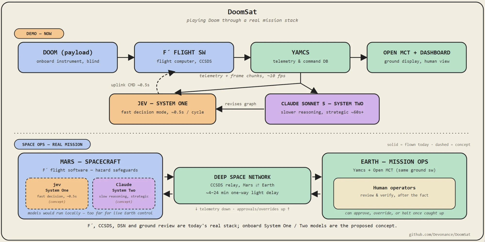
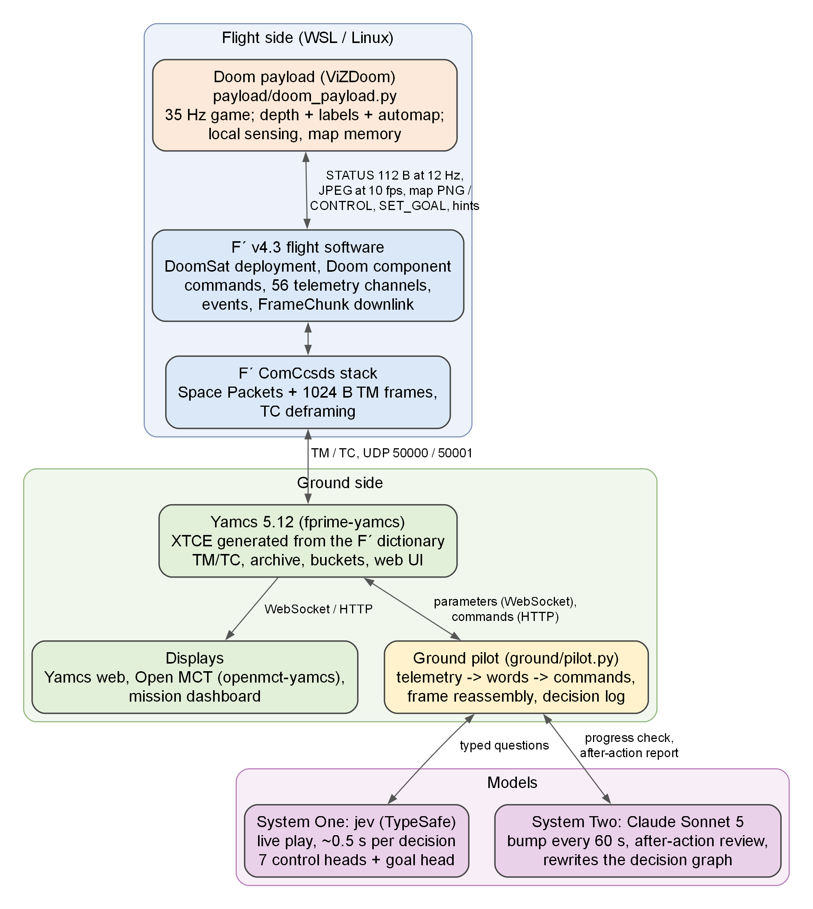
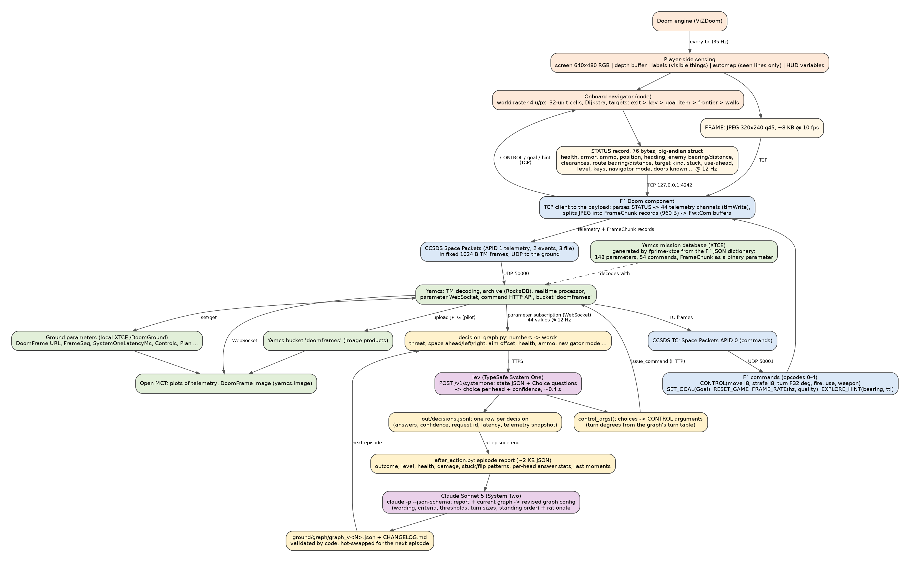
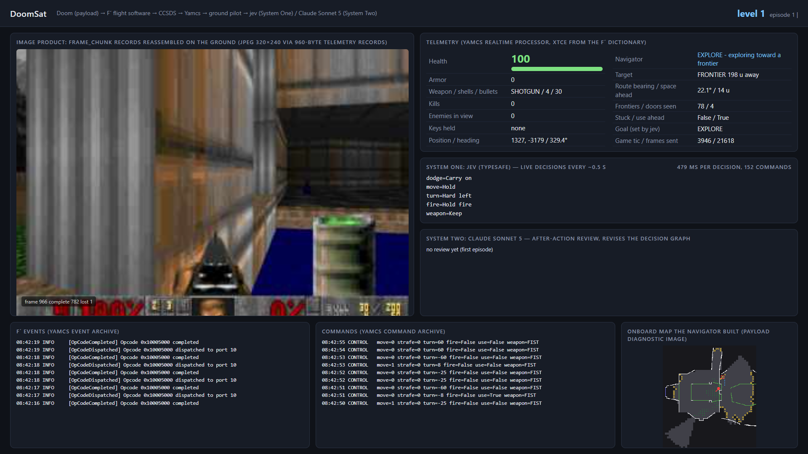
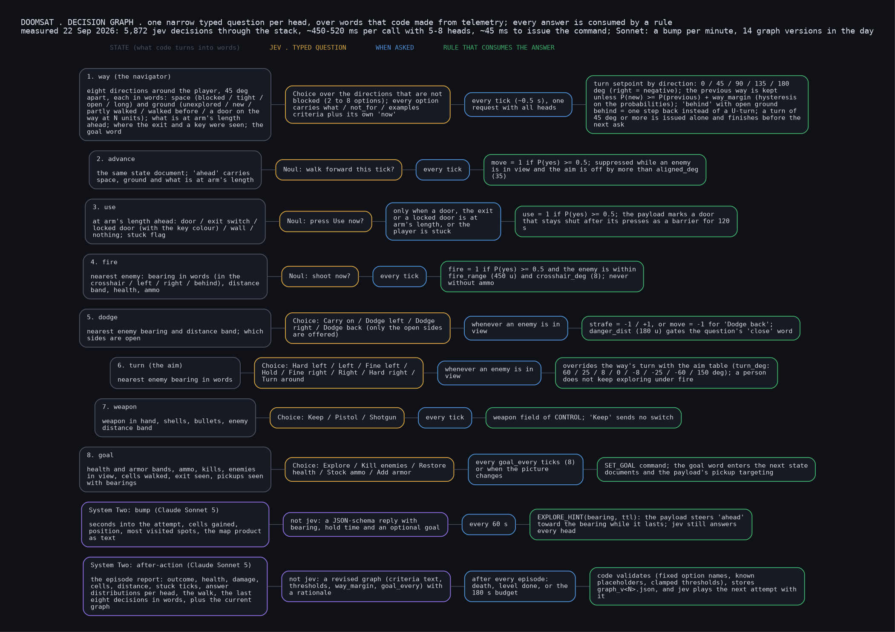
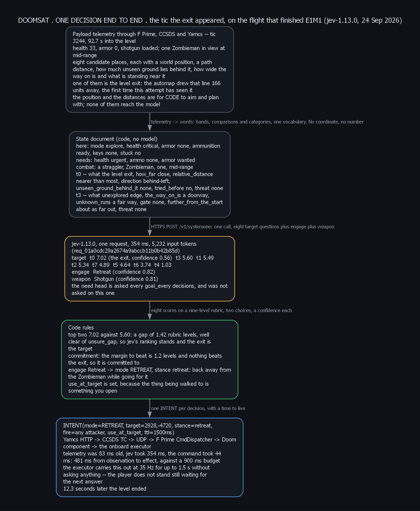
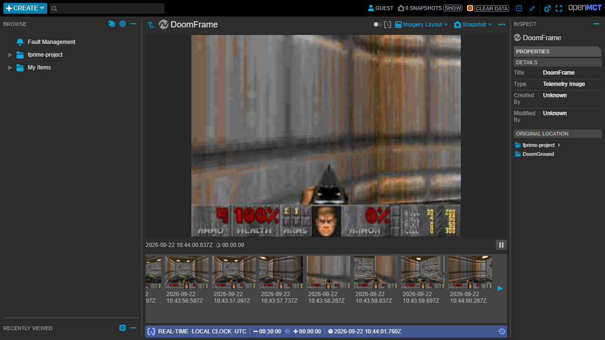
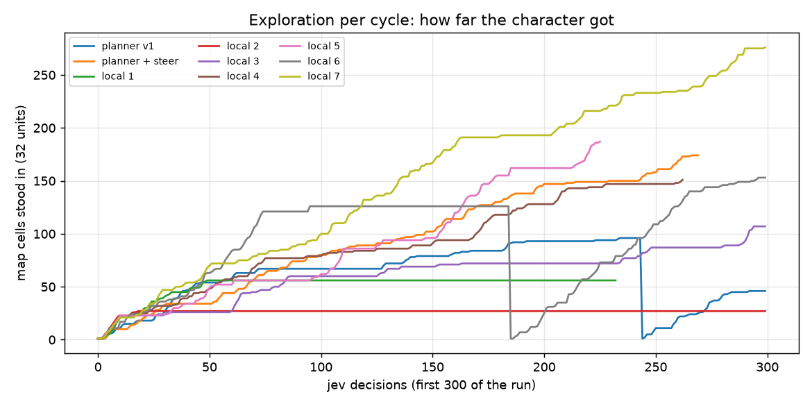

# DoomSat: playing Doom through a real mission stack

Doom runs as a **payload** behind an **F´ (F Prime) flight computer**. Telemetry and image products go
down through **CCSDS frames** into **Yamcs** (via `fprime-yamcs`; the XTCE mission database is generated from
the F´ dictionary) and are displayed in the **Yamcs web UI**, **Open MCT** and a small mission dashboard. A
ground pilot plays the game by uplinking commands: **jev** (TypeSafe's System One model) scores how promising
each open direction is, every half second, and code turns those scores into one command; **Claude Sonnet 5**
(System Two) nudges exploration once a minute and, after each attempt, rewrites the questions jev plays with.
Code owns the loop and never reads the level file.



## Data flow

Every message, its type and its rate, from the game to the models and back:



The dashboard (`tools/serve_dashboard.py`, everything on it comes from Yamcs) during a live jev run:



## What the player side is allowed to see

The rule for this demo: jev and code go in blind, like a person who knows how to play Doom but has never seen
the level. Nothing from the WAD reaches the payload or the models.

| Sense | What it stands in for | Source |
|---|---|---|
| Depth buffer (range camera) | where the walls are | ViZDoom depth buffer; calibrated: 7.16 map units per step, perpendicular distance |
| Object labels | recognising monsters, pickups, keys, barrels | ViZDoom labels buffer (only things in view) |
| In-game automap, *seen lines only* | the map a player sees on Tab | ZDoom automap in `NORMAL` mode: lines the player has looked at, in the engine's default categories (wall, floor step, ceiling change = door, locked door in its key colour, exit line); only the colours are changed so code can read them |
| HUD variables | health, armor, ammo, position, heading | ViZDoom game variables |

Not used: whole-map or "show objects" automap modes, the "show trigger lines" option, sector/line geometry
from the game state, monster counts, item lists, warp cheats. `tools/wad_stats.py` reads WADs but only as a
developer check for choosing levels and verifying results; the payload never imports it.

There is no route planner onboard. The payload (`payload/doom_payload.py`) stamps the automap into a world raster,
sweeps the floor it has seen with the range camera, remembers where it has walked, and reports eight directions
around the player (every 45 degrees): how far the way is open on the map, whether the ground that way is
unexplored, new, or walked before, and — on its own channel — how far off a door lies that way. It also reports
what is at arm's length ahead (a wall, a door, the exit switch, a locked door, something the map does not show),
where an exit line, a key or a pickup was seen, and whether the player is stuck. Obstacles the automap does not
draw (window bars, fake doors, barrels) are learned by pushing against them once. jev scores those words every
~0.5 s; every number is bucketed before jev sees it.

**Nothing survives an attempt.** Every episode, including a retry of the same level, starts with an empty world
model: no raster, no barrier marks, no door memory. The payload used to keep the map between attempts on the
reasoning that a player remembers a layout, and the effect was that every run after the first began on a level
it already believed was walled in (`EXPLORED_CELLS` 662 against 1 for a fresh one) — which is level knowledge,
and it confounded an afternoon of measurement before anyone noticed. `docs/CHARTER.md` §2.2 makes it a rule and
`research/honesty.py` makes it a test.

One more thing a player cannot do is read an exit line's colour from across a level, so an exit is only
*recognised* while it has been within 512 units and drawn on the automap this attempt; recognition is then
remembered, the way seeing a thing is. `EXIT_LINE_MAX_UNITS` in `payload/doom_payload.py`, 0 to remove exit
colouring entirely.

## The decision graph

jev classifies. It does not reason, plan or remember, so the graph asks it only the judgments that have no
exact rule behind them, and code does the rest:

| Head | Type | Asked | What code does with it |
|---|---|---|---|
| `sector` | Score, 4 levels | once per open direction, every tick in EXPLORE and APPROACH | ranks the directions, applies hysteresis on a **world bearing**, falls back to a named rule when the top two are too close |
| `danger` | Score, 4 levels | whenever an enemy is in view | sidestep, or back off |
| `goal` | Choice | every `goal_every` ticks | `SET_GOAL`, and a weight on the sector holding that goal's pickup |

Walking, doors, firing, weapon selection, aiming and the mode machine (EXPLORE, APPROACH, OPERATE, FIGHT,
RECOVER, DONE) are exact rules, so they live in `ground/decision_graph.py`, not in a question. Four things
follow from jev being stateless and literal, and code holds all four:

1. every fact a criterion mentions exists as a field of the state — `decision_graph.lint` refuses a graph
   that names one that does not, and checks the question text **as rendered**, after `{dir}` substitution;
2. anything that depends on the past is computed by code and written as a present-tense field (`NavMemory`):
   the committed direction is kept as a world bearing, so "keep going left" cannot mean a new direction
   after every turn;
3. any rule code can compute exactly stays in code;
4. every threshold on an answer has an unsure band and a **named** fallback, so a near-tie is never a coin flip.

`ground/graph_config.py` **rejects** a revision it cannot accept rather than trimming it, and hands the
reason back to System Two for one more try. The old version silently cut every string to 700 characters and
clamped the hysteresis margin, so ten of the last eleven reviews re-diagnosed the same truncation and every
tuning of the margin was a no-op. See `docs/audit-2026-09-22.md`.

## What is proven

- F´ dictionary -> XTCE -> Yamcs: 148 parameters / 54 commands load; every Doom channel decodes.
- Image products: each JPEG frame (320x240, ~8 KB) is split onboard into 960-byte `FrameChunk` telemetry
  records that bypass `Svc.TlmChan` sampling (straight into the com queue, APID 1) and ride the CCSDS TM frames;
  the ground reassembles ~10 fps with <1% loss and publishes them to the Yamcs bucket `doomframes`
  (`/DoomGround/DoomFrame` carries the URL for Open MCT and the dashboard).
- Uplink: CONTROL commands every ~0.5 s; the F´ command dispatcher, the Doom component and the payload all
  report them (events `OpCodeDispatched/Completed`, `GoalSet`, `LevelStarted`, `KeyPickedUp`).
- jev: one request per decision carrying a Score for each open direction (plus `danger` and, every 10th tick,
  `goal`), ~460 ms median including the Yamcs round trip; every decision row in `out/decisions.jsonl` carries
  the TypeSafe request id **and the exact state that was sent**, so a run can be replayed against a new graph
  without the game (`tools/replay.py`).
- Claude Sonnet 5 via the `claude` CLI as the after-action reviewer: one tool-free schema call per episode,
  returning the revised graph. The CLI runs with `DISABLE_NON_ESSENTIAL_MODEL_CALLS=1`, so no helper-model calls;
  `--system-two anthropic` uses the API directly.

Integration findings worth keeping:
1. F´ `string` telemetry is serialized length-prefixed, but `fprime-xtce` emits a fixed-size string type, so
   Yamcs rejects every packet carrying one (the string channel became an enum).
2. Opaque byte arrays need the `!binary` annotation (`fprime-xtce` PR #8, installed from the branch); the
   whole-struct form rejects array members, the array form works.
3. `FW_COM_BUFFER_MAX_SIZE` must be raised (512 -> 1000) through a `CONFIGURATION_OVERRIDES` config module
   (`flight/config`), not `settings.ini`'s `config_directory`.
4. `Svc.LinuxTimer` must tick faster than 1 Hz or the `ComAggregator` holds the last chunk of a frame until its
   timeout; the deployment runs a 20 Hz base clock.
5. Yamcs delivers F´ booleans as the strings "True"/"False"; a Yamcs bucket holds at most 1000 objects (image
   products are written into a ring of 20 names); the parameter WebSocket drops after a few minutes.
6. The ViZDoom depth buffer is perpendicular (z) distance at 7.16 units per step, its value 0 is the sky, and the
   crosshair is drawn into it; the automap draws the player arrow over the lines beneath it.

## Layout

| Path | What |
|---|---|
| `flight/Components/Doom/` | F´ component: commands, 64 telemetry channels, events, FrameChunk downlink (frames and the map product) (FPP + C++) |
| `flight/DoomSat/Top/`, `flight/config/` | topology/instances/rate groups, com-buffer override (copied into the WSL project) |
| `payload/doom_payload.py` | the game as an instrument: automap (seen lines) + range camera + labels, local sensing in eight directions, map memory, level progression |
| `payload/selfplay.py`, `payload/nav_probe.py` | code-only drivers of the navigator (no models) for fast iteration |
| `ground/pilot.py` | the loop: Yamcs subscriptions, frame reassembly, jev control step, after-action reviews, commands |
| `ground/decision_graph.py` | telemetry -> a structured state, the three heads, the mode machine, the selection rules, the reflex layer, the criteria linter |
| `ground/graph_config.py` | the graph as data, with bounds code enforces by rejecting (versioned in `ground/graph/`) |
| `ground/metrics.py` | one frozen definition per number the runs are compared on, shared by the report and the replay |
| `ground/after_action.py` | the episode report (built from the heads actually asked) and the System Two review call |
| `ground/providers.py` | System One: TypeSafe (jev) or any OpenAI-compatible endpoint; System Two: Claude CLI, Anthropic API or OpenAI-compatible |
| `ground/yamcs/`, `ground/openmct/`, `ground/dashboard/` | Yamcs config + ground XTCE, Open MCT config, the mission dashboard page |
| `docs/` | diagrams (Graphviz sources + renders), report (`doomsat-report.md/.tex/.pdf`), handoff (`HANDOFF.md`), images, charts, `video/` |
| `runs/<date>/` | the day's decision logs (one row per jev decision: **the exact state sent**, the answers, the selection detail, request id, latency, telemetry), pilot log, final graph, map, replay results |
| `docs/CHARTER.md` | the mission, the knowledge boundary, the architecture and the build order; `docs/CHARTER-STATUS.md` says what of it is built |
| `knowledge/doom_rules.yaml` | how Doom works: monsters, weapons, ammo, pickups, keys, doors, damaging floors. Values only, no level ever named |
| `research/` | the ruler. `PROGRAM.md` (the rules of the loop), `levels.yaml` (dev and test sets, and every charter decision as one value), `frozen_metrics.py`, `honesty.py`, `preflight.py`, `runner.py` (bench and flight), `grade.py`, `ledger.py` + `ledger.tsv` |
| `research/grader/` | the only code allowed to open a WAD, in its own process: walkability, the distance field, the score. It refuses to import inside a pilot |
| `tests/` | `python -m unittest discover -s tests` — 173 tests, no network and no game: the state, the selection, the modes, the reflex layer, the graph contract, the report's head coverage, the honesty suite and its canary, the grader and the keep rule |
| `scripts/`, `tools/` | start/stop/build helpers (WSL), replay and boundary-set tools, run report, charts, decision-graph figures, screenshots/recording, developer probes |

## Running it

Prerequisites on this machine: WSL distro `ros2` with `/root/doom/DoomSat` (F´ v4.3.0 bootstrap +
`fprime-yamcs`), `/root/doom/payload-venv` (ViZDoom 1.3.0), the shareware `doom1.wad` in `/root/doom/wads`
(`tools/get_doom1.sh`; Freedoom is bundled with ViZDoom as a fallback: `WAD=freedoom2.wad MAP=MAP01`),
`ground/.venv` (yamcs-client), `external/openmct-yamcs` with an Open MCT build, the `claude` CLI, and the day's
TypeSafe key in `ground/.env` (`TYPESAFE_API_KEY=...`).

```
scripts/flight.sh start                    # WSL: payload (E1M1) + fprime-yamcs (Yamcs :8090) + DoomSat binary
scripts/flight.sh payload                  # restart only the game process (after editing the payload)
scripts/flight.sh check                    # telemetry, frame chunks, events, links
python tools/serve_dashboard.py            # mission dashboard on :8070 (proxies the Yamcs API)
scripts/start_openmct.sh                   # Open MCT on :9000
scripts/start_pilot.sh --duration 1800     # jev plays; Sonnet bumps every 60 s, 180 s budget per level attempt; logs in out/
scripts/start_pilot.sh --bump-every 0 --level-budget 0   # no bumps, no budget: jev + graph only
scripts/start_pilot.sh --no-after-action   # jev + code only, graph frozen at ground/graph/graph_current.json
python tools/run_report.py                 # what each layer did in the last run (levels, decisions, reviews)
python -m unittest discover -s tests       # the graph's contract and behaviour, no network, no game
python tools/boundary_set.py --log runs/2026-09-22/decisions.jsonl --out runs/boundary_set.jsonl
python tools/replay.py --pilots code,jev --cases 120 --passes 3    # the gate: jev against a code-only baseline
node tools/dashboard_record.mjs out/dashrec 120         # 1080p dashboard capture (frames); python tools/stack_video.py --frames out/dashrec out/dash.mp4
node tools/stack_record.mjs out/stackrec 120            # dashboard + Yamcs telemetry + Yamcs commands + Open MCT; python tools/stack_video.py out/stackrec out/stack.mp4
python tools/charts.py                     # charts for the report from out/decisions*.jsonl
scripts/start_pilot.sh --system-one openai --openai-base-url http://localhost:1234/v1 --system-one-model <local>
```

After editing anything under `flight/`: `scripts/flight.sh build` (incremental) or `rebuild`, then
`scripts/flight.sh start`.

## Who decides what

| Layer | Runs | Decides |
|---|---|---|
| Flight code (F´ + payload) | 35 Hz / 20 Hz | safety (uplink loss -> hold), heading setpoint loop, the map, the eight-sector sensing, door and barrier memory, door/switch attempts |
| Ground code (the pilot) | every ~0.5 s | the mode machine and every transition in it, walking, doors, firing, weapon selection, aiming, sidestepping, the hysteresis, the unsure fallback, and a reflex layer that never fires at zero ammo, never walks into a known wall and never re-commands a turn still in flight |
| System One: jev | every ~0.5 s, live | the judgments with no exact rule behind them: one Score per open direction (how promising it is for reaching the exit) on a shared 4-level rubric, one Score for how dangerous the scene is when an enemy is in view, and every 10th tick the `goal` Choice |
| System Two: Claude Sonnet 5 | every minute, and after an episode | every minute: reads the map product and the recent walk and pushes exploration in a direction (`EXPLORE_HINT`, optionally `SET_GOAL`); after an episode (death, level finished, or the 3-minute level budget spent -> `RESET_GAME`): reads the after-action report and revises the graph — wording, rubric levels and the numbers in `thresholds` and `select`. A revision outside the bounds is rejected with the reason and it gets one more try |





Nothing slower than jev sits in the live loop. The graph is data (`ground/graph_config.py`); every revision is
validated by code (fixed head names and types, bounded text, numeric ranges, and a lint of every state field
the criteria name) and stored as `ground/graph/graph_v<N>.json` with Sonnet's rationale in
`ground/graph/CHANGELOG.md`. The System One model is **pinned** to `jev-1.13.0` rather than `jev-latest`,
because the numbers in `select` are tuned against one version.

## Status (22 September 2026)

The stack works end to end under load and every layer is measured; the autonomous player explores, opens the
first door and dies honestly, but does not yet finish E1M1. The report `docs/doomsat-report.md` (also `.tex`
and `.pdf`) has the numbers, the data flow, the results per cycle and the reasons. `docs/HANDOFF.md` is the
handoff for the next pass. `python tools/run_report.py` prints the current run.

Later the same day, an audit of the decision graph found fourteen issues — most of them in the code around jev,
not in jev's answers — and the graph was rewritten against them. **`docs/audit-2026-09-22.md` is the record:**
what changed per issue, what the replay measured, and what it did not settle. The short version:

- Every System Two edit had been silently cut at 700 characters and the hysteresis margin silently clamped, so
  ten of the last eleven reviews re-diagnosed the same truncation and every tuning of the margin was a no-op.
  Code now rejects a revision it cannot accept and hands the reason back for one more try.
- The direction commitment was the *word* "left", which names a new direction after every turn. It is now a
  world bearing, so holding a direction becomes walking rather than another 90 degrees.
- Four of the eight heads were asking jev to re-derive rules code already had. They are code now, and the
  `danger` Score — a judgment with no exact rule — took their place.
- The unsure band was first written as "a near tie **and** low confidence" and never fired once in 116 replayed
  states: each sector is scored by its own isolated question, so its `confidence` says nothing about how it
  ranks against the others. The band is on the gap, and the threshold (0.10 rubric levels) comes from replay:
  below it jev's own ranking flips ~30% between identical passes; at or above it, 0 of 51 states flipped.
- The honest check the audit asked for is now a gate, not a footnote: `tools/replay.py --pilots code,jev` runs
  the same states through jev and through a code-only function that encodes the rubric exactly. The rubric as
  written is close to a function of four enum fields, so jev reproduces it and adds little. That is the
  argument for the next pass — evidence no rule can read (the surface classifier), not a different question.
- **Flying it found three freezes that no test caught**, because each is a property of a sequence of ticks
  rather than of one decision: OPERATE could not give up, so the pilot stood at one door for 1,172
  consecutive decisions commanding nothing; FIGHT triggered on bare visibility, so it spent 211 decisions
  staring at an enemy 2,139 units away; and the reflex "never walk into a known wall" deadlocked the stuck
  detector that depends on the player pushing, so it sat in one spot for 553 decisions with `STUCK` false.
  All three are fixed and all three now have tests.
- **The first comparison was wrong twice over.** It used the old run's *first* 150 seconds — the best of
  its 27 windows — and every new-graph run had started on a map the payload had already filled with
  barrier marks from the run before (`EXPLORED_CELLS` 662 at the start, against 1 for the baseline). From a
  restarted payload and matched windows, the new graph's median beats **27 of 27** old windows on cells
  explored and on distance walked, and its worst window clears the old median on all three measures. The
  spin metric was also partly measuring the new design, which waits out its turns, so there is now a
  fixed-time window alongside the per-tick one — and small corrections are taken while walking.
- **The state churn was split into its causes** (`tools/churn_check.py`). Two fifths of the apparent churn
  on turning ticks was the egocentric labels sliding under the readings; bin edges accounted for ~3%; the
  rest is the payload re-sensing the same world direction differently. Sector words are now held against
  the ray's world bearing, and a *better* reading has to be confirmed while a *worse* one is believed at
  once — a third less churn for lag that can only ever delay good news.
- **The four-level rubric was saturated**: scores clustered at 2.7–2.9, the median gap between the top two
  was 0.08 levels, the fallback fired on 43% of ticks, and a visible exit tied with any fresh corridor.
  Nine levels now, with the exit at the top. Flown, the median gap is ~1.0 levels and the fallback ~10%.

Recordings of the last run of the day, 1080p, jev live through the stack:

- `docs/video/doomsat_dashboard_1080p.mp4`: the mission dashboard (frames, telemetry, jev's decisions, Sonnet's bumps and reviews, F´ events, the command archive, the map product), all read from Yamcs.
- `docs/video/doomsat_stack_1080p.mp4`: the dashboard, the Yamcs telemetry page, the Yamcs command history and Open MCT side by side.






## Sources

Frameworks and services used, with the versions in this repository:

- NASA F´ flight software framework, v4.3.0: https://github.com/nasa/fprime
- fprime-yamcs (Yamcs bridge and launcher for F´) 0.2.1 and fprime-xtce (dictionary -> XTCE, PR #8 branch for `!binary`): https://github.com/fprime-community/fprime-yamcs, https://github.com/FarkasJoseph/fprime-xtce/tree/feature/binary-annotation-combined
- Yamcs mission control 5.12.8: https://github.com/yamcs/yamcs
- NASA Open MCT (built from master): https://github.com/nasa/openmct
- openmct-yamcs plugin: https://github.com/akhenry/openmct-yamcs
- TypeSafe jev (System One) and the Python SDK: https://docs.typesafe.ai/introduction, https://docs.typesafe.ai/sdk/python/api
- Claude Sonnet 5 through Claude Code (System Two): https://code.claude.com/docs
- ViZDoom 1.3.0 (Doom engine bindings; ZDoom automap/depth/labels buffers): https://vizdoom.farama.org, https://github.com/Farama-Foundation/ViZDoom
- Shareware Doom IWAD (`doom1.wad`, from the Debian `doom-wad-shareware` package) and Freedoom: https://freedoom.github.io
- yamcs-client (Python) 2.1: https://github.com/yamcs/python-yamcs-client
- System One demo that this decision graph descends from (its Doom demo reads the WAD; ours does not): https://github.com/sgoedecke/system-one
- Prior LLM-plays-Doom work for comparison: https://adriandewynter.substack.com/p/will-gpt-4-and-5-run-doom
- Graphviz (diagrams), Playwright + Chrome (screenshots, recording), tectonic (PDF report)
