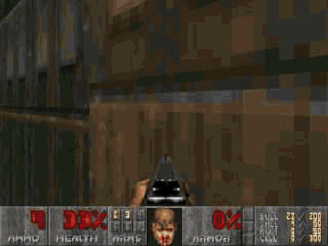

# DoomSat

Doom runs as the payload of a spacecraft. An **F´** flight computer sends its telemetry and video down through
**CCSDS** frames to **Yamcs**, and you watch it in **Open MCT** or a small dashboard. The pilot on the ground is
**jev** (TypeSafe's fast decision model). Every half second it picks where to go and uplinks an intent.
**Claude** reviews each attempt. No part of the pilot ever reads the level file.

On 24 September 2026 jev finished **E1M1 in 105 s**, with no deaths, through the full stack.

<div align="center">
  
  <p><em>The last 28 seconds of the run that finished E1M1</em></p>
</div>


## Install

You need about 3 GB of disk, 15 to 20 minutes, and a [TypeSafe API key](https://docs.typesafe.ai) for jev.
You don't need a key for Claude: the pilot uses your [Claude Code](https://code.claude.com/docs) login.
Without a TypeSafe key, you can still [fly it yourself](#play-it-yourself-no-jev-no-key).

> **Shortcut:** open [Claude Code](https://code.claude.com/docs) in this folder and say *"set DoomSat up on
> this machine"*. [`CLAUDE.md`](CLAUDE.md) gives it the steps.

<details>
<summary><b>Windows 10/11 (WSL2)</b></summary>

<br>

Everything runs inside WSL2 (Ubuntu). Your Windows browser reaches it on `localhost`.

1. In **PowerShell as Administrator**:
   ```powershell
   wsl --install -d Ubuntu-24.04
   ```
   Restart if Windows asks you to, then open **Ubuntu** from the Start menu and create your user.
2. From here on, work in the Ubuntu terminal and follow the **Linux** steps below. Clone into your Linux home
   (`~/`), not `/mnt/c/...`, because builds on the Windows drive are many times slower.
3. On Windows 11, WSLg shows the Doom window from `payload/play.py`. On Windows 10 use `--check` instead.

*Optional, if you'd rather keep the repo on the Windows side and use Git Bash:* set
`DOOMSAT_WSL_DISTRO` (and `DOOMSAT_WSL_USER`) in `.env`. `scripts/flight.sh` then forwards itself into WSL.
Run `scripts/setup_ground.sh` from Git Bash so the pilot, the dashboard and Open MCT run on Windows.

</details>

<details>
<summary><b>Linux (Ubuntu 22.04 / 24.04, or inside WSL)</b></summary>

<br>

```bash
# 1. System packages
sudo apt update
sudo apt install -y git curl build-essential binutils python3 python3-venv python3-pip

# 2. Node.js 24 (for Open MCT)
curl -o- https://raw.githubusercontent.com/nvm-sh/nvm/v0.40.3/install.sh | bash
source ~/.nvm/nvm.sh && nvm install 24

# 3. Claude Code (for System Two; optional, the pilot runs without it)
curl -fsSL https://claude.ai/install.sh | bash      # then run `claude` once to log in

# 4. This repo, your key, and the install
git clone https://github.com/Devonance/DoomSat.git && cd DoomSat
cp .env.example .env && nano .env      # set TYPESAFE_API_KEY
scripts/flight.sh setup                # ViZDoom, F´ v4.3.0 + DoomSat build, Yamcs, WADs  (~10 min)
scripts/setup_ground.sh                # pilot venv + Open MCT build                      (~5 min)
python3 tools/doctor.py --jev          # checks every piece and makes one jev call
```

</details>

<details>
<summary><b>macOS (Apple Silicon or Intel), not yet tested</b></summary>

<br>

The scripts support macOS (the F´ build goes to `build-artifacts/Darwin/`), but nobody has run them end to end on
a Mac yet. The two likely weak spots are the Java runtime that fprime-yamcs bundles and ViZDoom's wheels. If a
step fails, please open an issue with the output.

```bash
# 1. Compiler, Python, git
xcode-select --install
brew install python@3.12 git          # `python3 --version` should now say 3.12

# 2. Node.js 24 and Claude Code
curl -o- https://raw.githubusercontent.com/nvm-sh/nvm/v0.40.3/install.sh | bash
source ~/.nvm/nvm.sh && nvm install 24
curl -fsSL https://claude.ai/install.sh | bash

# 3. This repo, your key, and the install
git clone https://github.com/Devonance/DoomSat.git && cd DoomSat
cp .env.example .env && open -e .env  # set TYPESAFE_API_KEY
scripts/flight.sh setup
scripts/setup_ground.sh
python3 tools/doctor.py --jev
```

</details>

Each `scripts/flight.sh setup` step can also run on its own: `payload`, `fprime` or `wads`. The same goes for
`scripts/setup_ground.sh python|openmct`. Re-running either script skips anything already installed.

## Run the whole stack

Use four terminals, or background the servers:

```bash
scripts/flight.sh start              # Doom payload + F´ + Yamcs          → http://localhost:8090
python3 tools/serve_dashboard.py     # mission dashboard                  → http://localhost:8070
scripts/start_openmct.sh             # Open MCT                           → http://localhost:9000
scripts/start_pilot.sh --duration 600   # jev plays; add --system-two none to leave Claude out
scripts/flight.sh stop
```

Logs go to `out/` (the pilot) and `~/doom/run/` (payload, Yamcs). `scripts/flight.sh check` prints a telemetry
health report.

## Play it yourself (no jev, no key)

To try the whole stack without a TypeSafe key, fly it yourself from the dashboard:

```bash
scripts/play.sh                 # you drive; opens http://localhost:8070
scripts/play.sh --autopilot     # or watch the code rules fly it (no model)
```

`play.sh` starts the flight side and the dashboard server if they aren't already running. Click the picture to
take the controls:

| Keys | |
|---|---|
| <kbd>W</kbd> <kbd>S</kbd> or <kbd>↑</kbd> <kbd>↓</kbd> | forward / back |
| <kbd>A</kbd> <kbd>D</kbd> or <kbd>←</kbd> <kbd>→</kbd> | turn left / right |
| <kbd>Q</kbd> <kbd>E</kbd> | strafe left / right |
| <kbd>F</kbd> or mouse button | fire |
| <kbd>Space</kbd> | use (doors, switches, the exit) |
| <kbd>2</kbd> <kbd>3</kbd> | pistol / shotgun |
| <kbd>Esc</kbd> | let go |

Your keys go up the same path the pilot's orders do: each change is a `CONTROL` command issued to Yamcs, which
uplinks it to F´, which passes it to the game. The picture comes back down as telemetry. So what you see is the
real mission loop, round-trip latency included. The commands appear in the dashboard's command panel and in
Yamcs, and the telemetry and video appear in Open MCT (`scripts/start_openmct.sh`). Manual mode restarts the
level when it starts (`--no-reset` keeps the game as it is). It logs to `out/manual.jsonl`, never to the pilot's
`out/decisions.jsonl`. <kbd>Ctrl</kbd>+<kbd>C</kbd> stops it, and `scripts/flight.sh stop` stops the flight
side.

`--autopilot` flies the pilot with `--system-one code`, the exact rules jev's questions restate. It is the
same code baseline as `research/runner.py --decider code`, flown on the full stack.

## Use each piece on its own

<details>
<summary><b>Doom (ViZDoom)</b>: play it, or check it headless</summary>

<br>

```bash
~/doom/payload-venv/bin/python payload/play.py            # a window; you play
~/doom/payload-venv/bin/python payload/play.py --check    # no window: 100 tics → out/doom_check.png
~/doom/payload-venv/bin/python payload/play.py --wad freedoom1.wad
```

</details>

<details>
<summary><b>F´</b>: the flight software with the stock F´ GDS</summary>

<br>

```bash
scripts/flight.sh gds          # the DoomSat deployment + F´ GDS → http://localhost:5000
scripts/flight.sh payload      # (another terminal) add the game, so the Doom channels move
```

The component is in `flight/Components/Doom/` and the topology in `flight/DoomSat/Top/`. After an edit, run
`scripts/flight.sh build`.

</details>

<details>
<summary><b>Yamcs</b>: mission control, fed by F´</summary>

<br>

```bash
scripts/flight.sh yamcs        # F´ + Yamcs, no game  → http://localhost:8090  (instance fprime-project)
scripts/flight.sh start        # the same, plus the game and the video frames
```

The Yamcs config is `ground/yamcs/`. The XTCE database is generated from the F´ dictionary at launch.

</details>

<details>
<summary><b>Open MCT</b>: the DoomSat displays</summary>

<br>

Open MCT reads everything from Yamcs, so start Yamcs first. You don't need the game or the pilot:

```bash
scripts/flight.sh yamcs        # or `start` for live Doom telemetry and video
scripts/start_openmct.sh       # → http://localhost:9000
```

The DoomSat configuration is `ground/openmct/index.html` and `index.js`. Edit it there:
`start_openmct.sh` copies it into the plugin's example on every start. In the tree, open
**fprime-project → DoomGround → DoomFrame** as an imagery view to see the video. Parameters under
**DoomSat_DoomSat** open as plots.

</details>

<details>
<summary><b>The dashboard</b></summary>

<br>

```bash
python3 tools/serve_dashboard.py      # → http://localhost:8070 (needs Yamcs on :8090)
```

This is one static page (`ground/dashboard/index.html`) with a proxy to the Yamcs API, and it needs nothing
installed.

</details>

<details>
<summary><b>jev (System One)</b>: with or without the stack</summary>

<br>

```bash
python3 tools/doctor.py --jev                          # one real call with your key
# jev (or the code-only baseline) playing Doom in one process, no F´ or Yamcs:
~/doom/payload-venv/bin/python research/runner.py bench --maps E1M1 --seeds 1 --budget 60 \
    --decider jev --wad ~/doom/wads/freedoom1.wad --out out/bench --allow-dirty
```

Use `--decider code` to run the same bench with no model.

</details>

<details>
<summary><b>Claude (System Two)</b></summary>

<br>

The pilot shells out to the `claude` CLI, so it uses your Claude Code login and needs no API key. Once a minute
Claude pushes exploration in a direction, and after each attempt it revises the questions jev is asked.

```bash
scripts/start_pilot.sh --system-two claude-cli      # default
scripts/start_pilot.sh --system-two anthropic       # the API instead; set ANTHROPIC_API_KEY in .env
scripts/start_pilot.sh --system-two none            # jev + code only
```

</details>

## Configuration

Everything is in one file, `.env` at the repo root. Copy it from [`.env.example`](.env.example):

| Variable | Needed for |
|---|---|
| `TYPESAFE_API_KEY` | jev (the pilot, the jev bench) |
| `ANTHROPIC_API_KEY` | only `--system-two anthropic` |
| `DOOMSAT_HOME` | where the flight side is installed (default `~/doom`) |
| `DOOMSAT_WSL_DISTRO`, `DOOMSAT_WSL_USER` | only when you drive WSL from Git Bash |

## Troubleshooting

<details>
<summary>Common problems</summary>

<br>

- **Start with `python3 tools/doctor.py`.** It lists what is missing and the command that fixes it.
- **Yamcs never comes up.** Read `~/doom/run/yamcs.log`. Port 8090 may already be taken.
- **Open MCT shows "Missing" rows.** That's the plugin's example layout. Browse the tree on the left instead.
  Yamcs has to be up first.
- **The jev call fails.** Check the key in `.env`. TypeSafe keys can expire.
- **The pilot can't reach Yamcs.** Wait about 30 s after `flight.sh start`, then run `scripts/flight.sh check`.
- **Scripts fail with `$'\r': command not found`.** Windows line endings have crept in. `.gitattributes`
  keeps `*.sh` as LF, so re-clone, or run `sed -i 's/\r$//' scripts/*.sh`.

</details>

## Learn more

- [docs/ARCHITECTURE.md](docs/ARCHITECTURE.md) covers what the player may see, the decision graph, who decides
  what, and the integration findings.
- [docs/results/](docs/results/) has the E1M1 finish: the [decision log](docs/results/e1m1-finished-decision-log.md),
  [every attempt](docs/results/e1m1-progress.html) and the [overnight report](docs/results/2026-09-24-overnight-report.md).
- [docs/CHARTER.md](docs/CHARTER.md) sets out the mission and its rules, and
  [docs/CHARTER-STATUS.md](docs/CHARTER-STATUS.md) says what is built.
- The full report is [docs/doomsat-report.pdf](docs/doomsat-report.pdf).
- Built on [F´](https://github.com/nasa/fprime) v4.3.0, [fprime-yamcs](https://github.com/fprime-community/fprime-yamcs) 0.2.1,
  [Yamcs](https://github.com/yamcs/yamcs) 5.12.8, [Open MCT](https://github.com/nasa/openmct) with
  [openmct-yamcs](https://github.com/akhenry/openmct-yamcs), [ViZDoom](https://vizdoom.farama.org) 1.3.0,
  [TypeSafe jev](https://docs.typesafe.ai) and [Claude Code](https://code.claude.com/docs).
