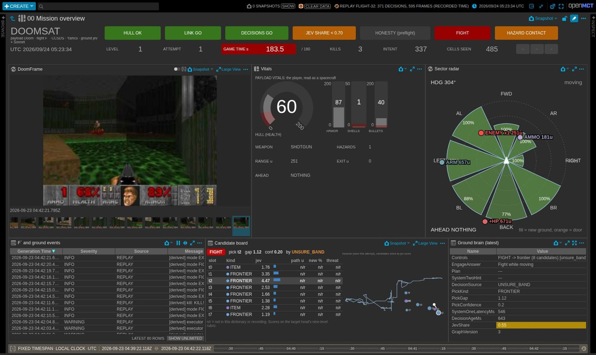
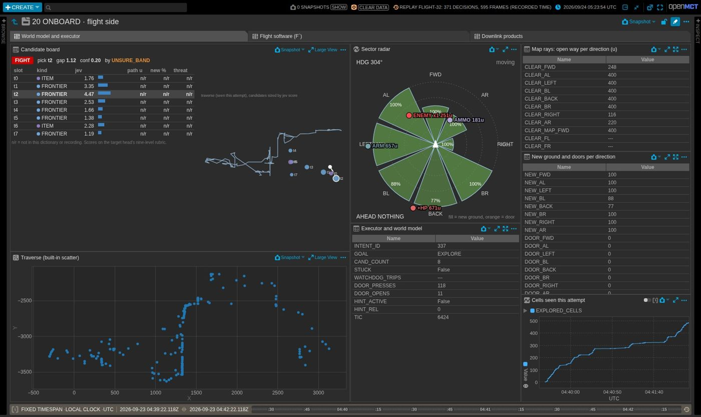
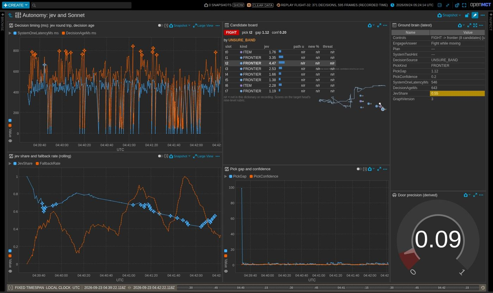
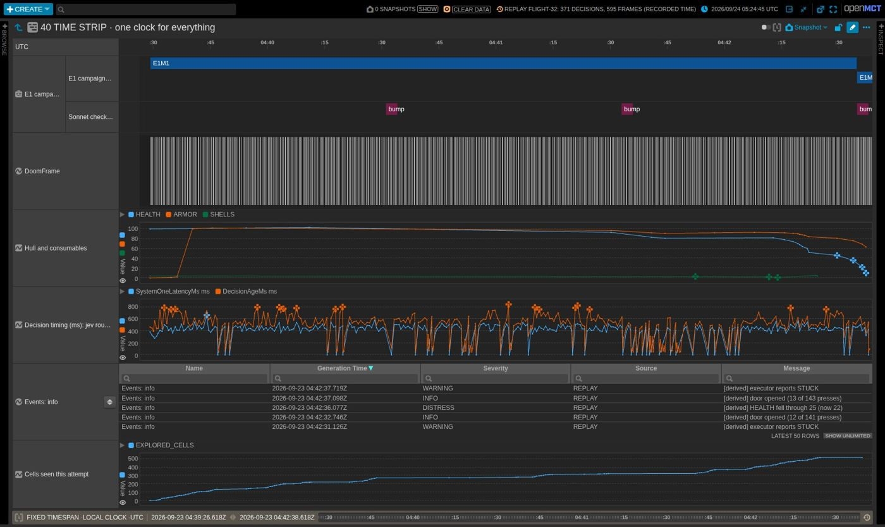

# Open MCT for DoomSat: operator reference

<!-- Generated by tools/build_openmct_displays.py --doc from the same objects as the displays. Do not edit by hand: change the build script or tools/openmct_docs.py and regenerate. -->

DoomSat's Open MCT displays treat Doom's player as the spacecraft, the F´ deployment and payload as the onboard side, and Yamcs, the pilot, jev and Sonnet as the ground side. They are generated as code (`tools/build_openmct_displays.py`), served read-only as **DoomSat Displays**, and run either live against Yamcs or offline against a recorded flight with no Yamcs at all. This page says what every screen, panel, indicator and value is. The design reasoning is in the pull request that added them.

## Running

**Live**, with the flight stack up (`scripts/flight.sh start`): `python tools/set_yamcs_alarms.py`, then `scripts/start_openmct.sh`, then http://localhost:9000 and open **DoomSat Displays** in the tree. `?commanding=on` enables the HOLD button; `?theme=snow` or `?theme=darkmatter` changes the theme.

**Replay**, no Yamcs: `python tools/build_openmct_replay.py` (from `research/out/flight-32`), then `python tools/openmct_serve.py` and open http://localhost:8071/replay.html. Add `?anchor=0` to serve the recorded timestamps (set the time conductor to Fixed), or leave it off to play the flight as if live. `python tools/openmct_snapshots.py` renders every screen to `out/openmct-shots/` and logs page errors.

**Changing a display**: edit `tools/build_openmct_displays.py` (and the note for any new panel in `tools/openmct_docs.py`), then `python tools/build_openmct_displays.py --doc`. `tests/test_openmct.py` fails if the committed displays or this page are out of date, if a display names a parameter no dictionary defines, or if a panel or parameter has no description.

## The tree

| Display | What it is for |
|---|---|
| 00 Mission overview | The front-room wall. One screen that answers two questions: is this attempt going well, and does anything need a person. Status strip on top, the player's view, vitals and the sector radar in the middle, and the last few seconds of the loop (events, the candidate board, the ground brain) along the bottom. |
| 10 GAME · the payload | Doom's player read as a spacecraft payload: what it sees, what it is carrying, what is around it, and the map it has drawn so far. |
| 20 ONBOARD · flight side | Everything onboard: the payload's world model and executor, the F´ flight computer, and the image products going down. |
| 30 GROUND · the other half of the loop | Everything on the ground: the pilot, jev (System One) and Sonnet (System Two), the ground data system, and the record of what went up and what came down. |
| 40 TIME STRIP · one clock for everything | The attempt on one time axis: the campaign plan, the camera, hull and consumables, decision timing, events and coverage. Scroll the time conductor and every lane moves together. |
| 50 AFTER-ACTION | Post-flight review. The research ledger's chart of every attempt, the campaign as a list, the Grader Wall and links out to Yamcs and the charter. |
| 60 POCKET · phone view | The overview cut down for a phone: four indicators, the camera, seven numbers. |
| Conditions | Every condition set and widget, for reuse. |
| Derived telemetry | Every computed value, for reuse. |
| Parts | The custom views and a few built panels, to duplicate into My Items when building new screens. |

The tree is read-only (Static Root plugin). To change a screen for yourself, right-click it, **Duplicate** into My Items, and edit the copy. To change it for everyone, change the build script.

## Screen by screen

### 00 Mission overview

The front-room wall. One screen that answers two questions: is this attempt going well, and does anything need a person. Status strip on top, the player's view, vitals and the sector radar in the middle, and the last few seconds of the loop (events, the candidate board, the ground brain) along the bottom.

| Panel | Type | What it shows | Inputs |
|---|---|---|---|
| Mission status strip | layout | Seven indicators and the numbers a flight director glances at: level, attempt, game time against the 180 s budget, kills, the current intent, cells seen, keys held. | LEVEL, Attempt, KILLS, INTENT_ID, EXPLORED_CELLS |
| DoomFrame | telemetry (imagery) | URL of the last reassembled JPEG in the Yamcs bucket doomframes (Open MCT shows it as imagery). | DoomFrame |
| Vitals | layout | Hull integrity as a dial, shielding and consumables as meters, then weapon, hazards and range, the exit if one has been recognised, and what is at arm's length. | WEAPON, ENEMY_COUNT, ENEMY_DIST, EXIT_DIST, AHEAD_KIND |
| Sector radar | doomsat.sectors | The payload's eight-direction sensing around the player, forward up. See Custom views. | - |
| F´ and ground events | table | Every event Yamcs has, newest first. In replay these are inferred from telemetry and marked [derived]. | Yamcs events |
| Candidate board | doomsat.candidates | The world model's candidate targets, jev's score for each, the pick and why, beside a plan view of the traverse. See Custom views. | - |
| Ground brain (latest) | LadTable | The latest of everything the ground decided: the Controls line, the engage answer, Sonnet's plan and hint, why the last pick came out as it did, gap, confidence, timing, jev share and graph version. | Controls, EngageAnswer, Plan, SystemTwoHint, DecisionSource, PickKind, PickGap, PickConfidence, SystemOneLatencyMs, DecisionAgeMs, JevShare, GraphVersion |

### 10 GAME · the payload

Doom's player read as a spacecraft payload: what it sees, what it is carrying, what is around it, and the map it has drawn so far.

| Panel | Type | What it shows | Inputs |
|---|---|---|---|
| DoomFrame | telemetry (imagery) | URL of the last reassembled JPEG in the Yamcs bucket doomframes (Open MCT shows it as imagery). | DoomFrame |
| Vitals over time | telemetry.plot.stacked | HEALTH, ARMOR, SHELLS and BULLETS stacked, each with its alarm limits drawn. | HEALTH, ARMOR, SHELLS, BULLETS |
| Sector radar | doomsat.sectors | The payload's eight-direction sensing around the player, forward up. See Custom views. | - |
| Surroundings | LadTable | Everything the payload reports about what is near the player: the nearest enemy, the worst threat in view, the exit and key if recognised, the nearest pickups, and what is at arm's length. | ENEMY_COUNT, ENEMY_DIST, ENEMY_BEARING, THREAT_CLASS, THREAT_COUNT, EXIT_DIST, EXIT_BEARING, KEY_DIST, KEY_BEARING, HEALTH_ITEM_DIST, AMMO_ITEM_DIST, ARMOR_ITEM_DIST, AHEAD_KIND, AHEAD_DIST, DOOR_AHEAD |
| DoomMap | telemetry (imagery) | URL of the last map product (the payload's own map, downlinked every 5 s). | DoomMap |
| Inventory and progress | LadTable | Weapon and ammunition, keys, kills, level and episode, and whether the level is done or the player is dead. | WEAPON, OWN_SHOTGUN, SHELLS, BULLETS, ARMOR, KEYS, KILLS, LEVEL, EPISODE, LEVEL_DONE, DEAD, EXPLORED_CELLS |

### 20 ONBOARD · flight side

Everything onboard: the payload's world model and executor, the F´ flight computer, and the image products going down.

#### Tab: World model and executor

What the onboard world model offered the ground, what jev thought of it, where the player has walked and what the executor is doing about it.

| Panel | Type | What it shows | Inputs |
|---|---|---|---|
| Candidate board | doomsat.candidates | The world model's candidate targets, jev's score for each, the pick and why, beside a plan view of the traverse. See Custom views. | - |
| Traverse (built-in scatter) | telemetry.plot.scatter-plot | POS_X against POS_Y through Open MCT's own Correlation Telemetry and Scatter Plot, for comparison with the candidate board's plan view. | - |
| Sector radar | doomsat.sectors | The payload's eight-direction sensing around the player, forward up. See Custom views. | - |
| Executor and world model | LadTable | The intent being executed, the navigation goal, how many candidates are on offer, whether the executor is stuck, watchdog trips, door presses and opens, Sonnet's exploration hint, and the game tic. | INTENT_ID, GOAL, CAND_COUNT, STUCK, WATCHDOG_TRIPS, DOOR_PRESSES, DOOR_OPENS, HINT_ACTIVE, HINT_REL, TIC |
| Map rays: open way per direction (u) | LadTable | Map-ray clearance in the eight directions, plus the range camera's forward, ahead-left and ahead-right bands. | CLEAR_FWD, CLEAR_AL, CLEAR_LEFT, CLEAR_BL, CLEAR_BACK, CLEAR_BR, CLEAR_RIGHT, CLEAR_AR, CLEAR_MAP_FWD, CLEAR_FL, CLEAR_FR |
| New ground and doors per direction | LadTable | Percentage of never-walked ground, and distance to a door (in 8-unit steps, 0 = none), in each of the eight directions. | NEW_FWD, NEW_AL, NEW_LEFT, NEW_BL, NEW_BACK, NEW_BR, NEW_RIGHT, NEW_AR, DOOR_FWD, DOOR_AL, DOOR_LEFT, DOOR_BL, DOOR_BACK, DOOR_BR, DOOR_RIGHT, DOOR_AR |
| Cells seen this attempt | telemetry.plot.overlay | EXPLORED_CELLS: 128-unit cells the player has stood in. Flat for long means circling; it resets to 1 at every level start (honesty test 3). | EXPLORED_CELLS |

#### Tab: Flight software (F´)

The F´ deployment as a flight computer: rate group timing and slips, CPU and memory, the command dispatcher, the event logger, health pings and the com buffer pool.

| Panel | Type | What it shows | Inputs |
|---|---|---|---|
| Rate group max time (us) | telemetry.plot.overlay | Longest cycle of each rate group since the last report. The 20 Hz group has 50,000 us; alarms at 25,000, 40,000 and 50,000. | RgMaxTime, RgMaxTime, RgMaxTime |
| Rate group cycle slips | telemetry.plot.overlay | Cycles each rate group failed to finish in time. Anything above zero is a warning. | RgCycleSlips, RgCycleSlips, RgCycleSlips |
| CPU (%) | gauge | F´ systemResources CPU. | CPU |
| Memory used (derived %) | gauge | MEMORY_USED over MEMORY_TOTAL. | - |
| Command, event and buffer health | LadTable | F´ command dispatcher counters, dropped events, late health pings, the com buffer pool, the payload link and the framework and project versions. | CommandsDispatched, CommandErrors, CommandsDropped, EventsDropped, PingLateWarnings, CurrBuffs, HiBuffs, NoBuffs, EmptyBuffs, PAYLOAD_LINK, CMDS_RECEIVED, FrameworkVersion, ProjectVersion |

#### Tab: Downlink products

The JPEG frame product: frames and 960-byte chunks sent, the size of the last frame, and chunks per frame.

| Panel | Type | What it shows | Inputs |
|---|---|---|---|
| Image products sent | telemetry.plot.overlay | Cumulative frames and chunks the Doom component has pushed into the com queue. | FRAMES_SENT, CHUNKS_SENT |
| Bytes in the last frame | telemetry.plot.overlay | Size of the most recent JPEG. Frames over the chunk budget are dropped onboard (event FrameTooLarge). | FRAME_BYTES |
| Downlink products (latest) | LadTable | Frames, chunks and bytes as latest values. | FRAMES_SENT, CHUNKS_SENT, FRAME_BYTES, PAYLOAD_LINK |
| Chunks per frame (derived) | LadTable | Chunks sent divided by frames sent. | - |

### 30 GROUND · the other half of the loop

Everything on the ground: the pilot, jev (System One) and Sonnet (System Two), the ground data system, and the record of what went up and what came down.

#### Tab: Autonomy: jev and Sonnet

The decision loop on the ground: how long a decision takes against the 900 ms budget, how many intent changes jev actually decided (the charter's 70% floor), how clear-cut each pick was, and what jev and Sonnet said last.

| Panel | Type | What it shows | Inputs |
|---|---|---|---|
| Decision timing (ms): jev round trip, decision age | telemetry.plot.overlay | jev's round trip and the approximate decision age, with their alarm limits (decision age critical past the 900 ms budget). | SystemOneLatencyMs, DecisionAgeMs |
| jev share and fallback rate (rolling) | telemetry.plot.overlay | Share of the last 40 intent changes that a jev answer decided, against the charter's 0.70 floor; and share of the last 40 decisions settled by the unsure band, a hold, the cache or a rule. | JevShare, FallbackRate |
| Candidate board | doomsat.candidates | The world model's candidate targets, jev's score for each, the pick and why, beside a plan view of the traverse. See Custom views. | - |
| Pick gap and confidence | telemetry.plot.overlay | How far the chosen candidate's score was clear of the next one, and jev's confidence in it. Small gaps are what the unsure band exists for. | PickGap, PickConfidence |
| Ground brain (latest) | LadTable | The latest of everything the ground decided: the Controls line, the engage answer, Sonnet's plan and hint, why the last pick came out as it did, gap, confidence, timing, jev share and graph version. | Controls, EngageAnswer, Plan, SystemTwoHint, DecisionSource, PickKind, PickGap, PickConfidence, SystemOneLatencyMs, DecisionAgeMs, JevShare, GraphVersion |
| Door precision (derived) | gauge | Door opens divided by door presses: whether the automap's ceiling-change category is telling the truth about what is a door. | - |

#### Tab: Ground data system

The ground half of the link: frame reassembly and loss, and the rate at which the pilot sends commands up.

| Panel | Type | What it shows | Inputs |
|---|---|---|---|
| Ground reassembly: frames complete and incomplete | telemetry.plot.overlay | How many frames the pilot put back together from FRAME_CHUNK records, and how many arrived with chunks missing. | FramesComplete, FramesIncomplete |
| Frame loss (derived %) | telemetry.plot.overlay | Incomplete frames as a percentage of all frames the ground saw. | - |
| Uplink: commands issued by the pilot | telemetry.plot.overlay | Cumulative INTENT (or CONTROL) commands the pilot has sent. The slope is the decision rate. | ControlCommands |
| Ground data system (latest) | LadTable | Frame sequence, reassembly counts, commands issued and Sonnet's last round trip, as latest values. | FrameSeq, FramesComplete, FramesIncomplete, ControlCommands, SystemTwoLatencyMs |

#### Tab: Command and event history

What went up (every INTENT, with its arguments) and what came down (F´ events, and in replay the events inferred from telemetry).

| Panel | Type | What it shows | Inputs |
|---|---|---|---|
| Command history (Yamcs) | table | Every command that went up, with its arguments and acknowledgement state. In replay: the INTENTs the pilot actually sent (acknowledgements were not recorded). | Yamcs command history |
| F´ and ground events | table | Every event Yamcs has, newest first. In replay these are inferred from telemetry and marked [derived]. | Yamcs events |
| Events: warning and above | table | The same, filtered to WARNING and worse. | Yamcs events, warning |

### 40 TIME STRIP · one clock for everything

The attempt on one time axis: the campaign plan, the camera, hull and consumables, decision timing, events and coverage. Scroll the time conductor and every lane moves together.

| Panel | Type | What it shows | Inputs |
|---|---|---|---|
| E1 campaign plan | plan | The charter's mission as a plan: E1M1 to E1M8 back to back at the 180 s budget each, with Sonnet's 60 s checkpoints on a second lane. Regenerate with --plan-start at the start of a campaign flight so planned and actual share a clock. | - |
| DoomFrame | telemetry (imagery) | URL of the last reassembled JPEG in the Yamcs bucket doomframes (Open MCT shows it as imagery). | DoomFrame |
| Hull and consumables | telemetry.plot.overlay | HEALTH, ARMOR and SHELLS on one axis, for the time strip. | HEALTH, ARMOR, SHELLS |
| Decision timing (ms): jev round trip, decision age | telemetry.plot.overlay | jev's round trip and the approximate decision age, with their alarm limits (decision age critical past the 900 ms budget). | SystemOneLatencyMs, DecisionAgeMs |
| Yamcs events, info | Yamcs events | F´ and ground events at that severity and above, as a lane on the same clock. | - |
| Cells seen this attempt | telemetry.plot.overlay | EXPLORED_CELLS: 128-unit cells the player has stood in. Flat for long means circling; it resets to 1 at every level start (honesty test 3). | EXPLORED_CELLS |

### 50 AFTER-ACTION

Post-flight review. The research ledger's chart of every attempt, the campaign as a list, the Grader Wall and links out to Yamcs and the charter.

| Panel | Type | What it shows | Inputs |
|---|---|---|---|
| E1M1: every attempt (research ledger chart) | webPage | docs/results/e1m1-progress.html embedded as a web page. | - |
| E1 campaign timelist | timelist | The same plan as a list, with the current and next activity. | - |
| Grader wall (post-flight only) | layout | The grader's overlay of the attempt on the true level geometry. WAD-derived, so post-flight only: no live screen links here, and nothing here is read by the pilot, jev or Sonnet. | - |
| Yamcs web UI | hyperlink | Opens Yamcs (http://localhost:8090) in a new tab. | - |
| Charter (knowledge boundary, metrics) | hyperlink | Opens docs/CHARTER.md on GitHub. | - |
| E1M1 finish decision log | hyperlink | Opens docs/results/e1m1-finished-decision-log.md on GitHub. | - |

### 60 POCKET · phone view

The overview cut down for a phone: four indicators, the camera, seven numbers.

| Panel | Type | What it shows | Inputs |
|---|---|---|---|
| Pocket status | layout | The four indicators that matter on a phone: hull, intent mode, decision timing, payload link. | - |
| DoomFrame | telemetry (imagery) | URL of the last reassembled JPEG in the Yamcs bucket doomframes (Open MCT shows it as imagery). | DoomFrame |
| Pocket numbers | LadTable | Seven numbers for the phone: hull, shielding, shells, kills, level, decision age, jev share. | HEALTH, ARMOR, SHELLS, KILLS, LEVEL, DecisionAgeMs, JevShare |

## Status indicators

Each indicator is a condition set (the rules) shown through a condition widget or conditional styling. Rules are checked top to bottom and the first match wins. Colours mean the same thing everywhere: green go, amber watch, orange warning, red critical or no go, grey unknown. A condition set outputs nothing until its first data arrives (Open MCT issue 5925), so before first data an indicator is blank or shows its fixed label.

| Condition set | Inputs | Rules, in order | Otherwise |
|---|---|---|---|
| Vitals | HEALTH, DEAD | DEAD is True → **DEAD**; HEALTH <= 25 → **HULL CRITICAL**; HEALTH <= 50 → **HULL LOW** | HULL OK |
| Payload link | PAYLOAD_LINK | PAYLOAD_LINK is False → **LINK NO GO**; PAYLOAD_LINK is True → **LINK GO** | LINK ? |
| Autonomy timing | DecisionAgeMs, SystemOneLatencyMs | DecisionAgeMs > 900 → **DECISION LATE**; DecisionAgeMs > 750 → **DECISION SLOW**; DecisionAgeMs <= 750 → **DECISIONS GO** | DECISIONS ? |
| jev share | JevShare | JevShare < 0.7 → **JEV SHARE < 0.70**; JevShare >= 0.7 → **JEV SHARE OK** | JEV SHARE ? |
| Honesty | HonestyStatus | HonestyStatus is FAIL → **HONESTY FAIL: VOID**; HonestyStatus is PASS → **HONESTY PASS** | HONESTY UNKNOWN |
| Intent mode | IntentMode | IntentMode is EXPLORE → **EXPLORE**; IntentMode is APPROACH → **APPROACH**; IntentMode is OPERATE → **OPERATE**; IntentMode is FIGHT → **FIGHT**; IntentMode is RETREAT → **RETREAT**; IntentMode is RECOVER → **RECOVER** | NO INTENT |
| Level budget | TIC | TIC > 6300 → **OVER BUDGET**; TIC > 5250 → **BUDGET WATCH** | IN BUDGET |
| Key red | KEYS | KEYS is one of 1,3,5,7 → **RED KEY** | - |
| Key blue | KEYS | KEYS is one of 2,3,6,7 → **BLUE KEY** | - |
| Key yellow | KEYS | KEYS is one of 4,5,6,7 → **YELLOW KEY** | - |
| Threat | ENEMY_COUNT | ENEMY_COUNT >= 4 → **HAZARDS 4+**; ENEMY_COUNT >= 1 → **HAZARD CONTACT** | NO HAZARDS |

## Derived telemetry

Computed in the browser by Open MCT's Derived Telemetry plugin (Open MCT 4.3 or later) from the named inputs; each can be plotted, tabled or used in a condition like any telemetry point.

| Name | Expression | Variables |
|---|---|---|
| Level game time (s) | `tic / 35` | tic = TIC |
| Door precision | `opens / max(presses, 1)` | opens = DOOR_OPENS, presses = DOOR_PRESSES |
| Frame reassembly loss (%) | `100 * bad / max(good + bad, 1)` | good = FramesComplete, bad = FramesIncomplete |
| Chunks per frame | `chunks / max(frames, 1)` | chunks = CHUNKS_SENT, frames = FRAMES_SENT |
| Memory used (%) | `100 * used / max(total, 1)` | used = MEMORY_USED, total = MEMORY_TOTAL |
| Player position (x, y) | x, y paired by timestamp (Correlation Telemetry) | x = POS_X, y = POS_Y |

## Custom views

### Sector Radar

Forward is up and left is left, as the player sees it. Each of the eight wedges is one direction the payload senses (FWD, AL, LEFT, BL, BACK, BR, RIGHT, AR). A wedge's **length** is the map ray's open way in that direction, up to 400 map units (the dotted rings are 100, 200, 300 and 400). Its **fill** is how much of the ground that way has never been walked: pale is walked, bright green is new, and the percentage is printed inside. An **orange bar** across a wedge is a door at that distance. Markers: a **red dot** is the nearest enemy in view (with the count and range), a **green triangle** the exit once recognised, a **yellow triangle** a remembered key, and small dots the nearest health (+HP), ammunition (AMMO) and armor (ARM) pickups. A **dashed magenta line** is Sonnet's exploration hint while it is in force. The top line gives the heading and whether the executor reports STUCK; the bottom line what is at arm's length.

### Candidate Board

Left: the candidates the onboard world model is offering this decision, one row per slot (t0 to t7): kind, jev's score on the nine-level rubric with a bar, path units along the seen floor, percent new ground behind it, and live things near it. The picked row is highlighted. The header gives the intent mode, the picked slot, the gap to the runner-up, jev's confidence, and **by**: who decided (JEV in green, anything else in orange; see DecisionSource). `n/r` means the value is not in the dictionary or not in the recording. Right: a north-up plan view of the attempt so far. The pale line is the player's traverse within the time conductor's bounds, circles are the candidates coloured by kind and sized by score, the dashed white line runs from the player to the pick, and the white tick is the heading.

### HOLD (safe mode)

A guarded button that sends `SET_GOAL HOLD`, the payload's safe mode. It is disabled unless the page is opened with `?commanding=on`, it asks for confirmation, and it tags the command as human-origin. Code owns the loop in DoomSat; a human command changes who made the decision and has to be excluded from jev_share, so this is a flight-rule safety action, never a way to play.

## Parameters

Every parameter a display or custom view reads. Alarm ranges for flight parameters are applied at runtime by `tools/set_yamcs_alarms.py` from `ground/yamcs/alarm-ranges.json`; ground ones are in the XTCE. Types come from the XTCE, and from `Doom.fpp` where the committed `fprime.xtce.xml` lacks a channel (marked **snapshot lag**). That file is a reference snapshot: Yamcs never loads it, because `scripts/wsl_run_flight.sh` starts fprime-yamcs with the deployment, and fprime-yamcs regenerates the XTCE from the deployment's F´ dictionary at every launch. A snapshot-lag channel is live as soon as the deployment is built from the current `Doom.fpp`.

### Flight: the Doom payload component

| Parameter | Type | Meaning |
|---|---|---|
| `doom/AHEAD_DIST` | integer | Distance to that thing. |
| `doom/AHEAD_KIND` | enumeration | What is at arm's length ahead: NOTHING, WALL, DOOR, EXIT, LOCKED, BARRIER (something the map does not show) or THING. |
| `doom/AMMO_BEARING` | float | Bearing to that ammunition pickup. |
| `doom/AMMO_ITEM_DIST` | integer | Distance to the nearest ammunition pickup seen. |
| `doom/ANGLE` | float | Player heading, degrees. |
| `doom/ARMOR` | integer | Armor points, 0 to 200. |
| `doom/ARMOR_BEARING` | float | Bearing to that armor pickup. |
| `doom/ARMOR_ITEM_DIST` | integer | Distance to the nearest armor pickup seen. |
| `doom/BULLETS` | integer | Bullets held (pistol, chaingun). |
| `doom/CAND0.kind` | enumeration, **snapshot lag** | Candidate slot 0: what kind of place: FRONTIER, DOOR, EXIT, KEY, ITEM, SWITCH, ENEMY. |
| `doom/CAND0.novelty` | integer, **snapshot lag** | Candidate slot 0: how much unseen ground lies behind it. |
| `doom/CAND0.pathUnits` | integer, **snapshot lag** | Candidate slot 0: distance along floor the payload has seen (not the straight line). |
| `doom/CAND0.threatCount` | integer, **snapshot lag** | Candidate slot 0: live things near it. |
| `doom/CAND0.x` | float, **snapshot lag** | Candidate slot 0: x, map units. |
| `doom/CAND0.y` | float, **snapshot lag** | Candidate slot 0: y, map units. |
| `doom/CAND1.kind` | enumeration, **snapshot lag** | Candidate slot 1: what kind of place: FRONTIER, DOOR, EXIT, KEY, ITEM, SWITCH, ENEMY. |
| `doom/CAND1.novelty` | integer, **snapshot lag** | Candidate slot 1: how much unseen ground lies behind it. |
| `doom/CAND1.pathUnits` | integer, **snapshot lag** | Candidate slot 1: distance along floor the payload has seen (not the straight line). |
| `doom/CAND1.threatCount` | integer, **snapshot lag** | Candidate slot 1: live things near it. |
| `doom/CAND1.x` | float, **snapshot lag** | Candidate slot 1: x, map units. |
| `doom/CAND1.y` | float, **snapshot lag** | Candidate slot 1: y, map units. |
| `doom/CAND2.kind` | enumeration, **snapshot lag** | Candidate slot 2: what kind of place: FRONTIER, DOOR, EXIT, KEY, ITEM, SWITCH, ENEMY. |
| `doom/CAND2.novelty` | integer, **snapshot lag** | Candidate slot 2: how much unseen ground lies behind it. |
| `doom/CAND2.pathUnits` | integer, **snapshot lag** | Candidate slot 2: distance along floor the payload has seen (not the straight line). |
| `doom/CAND2.threatCount` | integer, **snapshot lag** | Candidate slot 2: live things near it. |
| `doom/CAND2.x` | float, **snapshot lag** | Candidate slot 2: x, map units. |
| `doom/CAND2.y` | float, **snapshot lag** | Candidate slot 2: y, map units. |
| `doom/CAND3.kind` | enumeration, **snapshot lag** | Candidate slot 3: what kind of place: FRONTIER, DOOR, EXIT, KEY, ITEM, SWITCH, ENEMY. |
| `doom/CAND3.novelty` | integer, **snapshot lag** | Candidate slot 3: how much unseen ground lies behind it. |
| `doom/CAND3.pathUnits` | integer, **snapshot lag** | Candidate slot 3: distance along floor the payload has seen (not the straight line). |
| `doom/CAND3.threatCount` | integer, **snapshot lag** | Candidate slot 3: live things near it. |
| `doom/CAND3.x` | float, **snapshot lag** | Candidate slot 3: x, map units. |
| `doom/CAND3.y` | float, **snapshot lag** | Candidate slot 3: y, map units. |
| `doom/CAND4.kind` | enumeration, **snapshot lag** | Candidate slot 4: what kind of place: FRONTIER, DOOR, EXIT, KEY, ITEM, SWITCH, ENEMY. |
| `doom/CAND4.novelty` | integer, **snapshot lag** | Candidate slot 4: how much unseen ground lies behind it. |
| `doom/CAND4.pathUnits` | integer, **snapshot lag** | Candidate slot 4: distance along floor the payload has seen (not the straight line). |
| `doom/CAND4.threatCount` | integer, **snapshot lag** | Candidate slot 4: live things near it. |
| `doom/CAND4.x` | float, **snapshot lag** | Candidate slot 4: x, map units. |
| `doom/CAND4.y` | float, **snapshot lag** | Candidate slot 4: y, map units. |
| `doom/CAND5.kind` | enumeration, **snapshot lag** | Candidate slot 5: what kind of place: FRONTIER, DOOR, EXIT, KEY, ITEM, SWITCH, ENEMY. |
| `doom/CAND5.novelty` | integer, **snapshot lag** | Candidate slot 5: how much unseen ground lies behind it. |
| `doom/CAND5.pathUnits` | integer, **snapshot lag** | Candidate slot 5: distance along floor the payload has seen (not the straight line). |
| `doom/CAND5.threatCount` | integer, **snapshot lag** | Candidate slot 5: live things near it. |
| `doom/CAND5.x` | float, **snapshot lag** | Candidate slot 5: x, map units. |
| `doom/CAND5.y` | float, **snapshot lag** | Candidate slot 5: y, map units. |
| `doom/CAND6.kind` | enumeration, **snapshot lag** | Candidate slot 6: what kind of place: FRONTIER, DOOR, EXIT, KEY, ITEM, SWITCH, ENEMY. |
| `doom/CAND6.novelty` | integer, **snapshot lag** | Candidate slot 6: how much unseen ground lies behind it. |
| `doom/CAND6.pathUnits` | integer, **snapshot lag** | Candidate slot 6: distance along floor the payload has seen (not the straight line). |
| `doom/CAND6.threatCount` | integer, **snapshot lag** | Candidate slot 6: live things near it. |
| `doom/CAND6.x` | float, **snapshot lag** | Candidate slot 6: x, map units. |
| `doom/CAND6.y` | float, **snapshot lag** | Candidate slot 6: y, map units. |
| `doom/CAND7.kind` | enumeration, **snapshot lag** | Candidate slot 7: what kind of place: FRONTIER, DOOR, EXIT, KEY, ITEM, SWITCH, ENEMY. |
| `doom/CAND7.novelty` | integer, **snapshot lag** | Candidate slot 7: how much unseen ground lies behind it. |
| `doom/CAND7.pathUnits` | integer, **snapshot lag** | Candidate slot 7: distance along floor the payload has seen (not the straight line). |
| `doom/CAND7.threatCount` | integer, **snapshot lag** | Candidate slot 7: live things near it. |
| `doom/CAND7.x` | float, **snapshot lag** | Candidate slot 7: x, map units. |
| `doom/CAND7.y` | float, **snapshot lag** | Candidate slot 7: y, map units. |
| `doom/CAND_COUNT` | integer, **snapshot lag** | How many of the eight candidate slots are filled. |
| `doom/CHUNKS_SENT` | integer | 960-byte FrameChunk records sent. |
| `doom/CLEAR_AL` | integer | Map ray: open way, map units, ahead-left (45°). |
| `doom/CLEAR_AR` | integer | Map ray: open way, map units, ahead-right. |
| `doom/CLEAR_BACK` | integer | Map ray: open way, map units, behind. |
| `doom/CLEAR_BL` | integer | Map ray: open way, map units, behind-left (135°). |
| `doom/CLEAR_BR` | integer | Map ray: open way, map units, behind-right. |
| `doom/CLEAR_FL` | integer | Range camera, free space in the ahead-left band. |
| `doom/CLEAR_FR` | integer | Range camera, free space in the ahead-right band. |
| `doom/CLEAR_FWD` | integer | Range camera: free space straight ahead, map units. |
| `doom/CLEAR_LEFT` | integer | Map ray: open way, map units, left (90°). |
| `doom/CLEAR_MAP_FWD` | integer | Map ray straight ahead (the range camera's CLEAR_FWD is the other reading). |
| `doom/CLEAR_RIGHT` | integer | Map ray: open way, map units, right. |
| `doom/CMDS_RECEIVED` | integer | Commands the Doom component has received. |
| `doom/DEAD` | enumeration | The player is dead. Critical when True. |
| `doom/DOOR_AHEAD` | enumeration | Something usable is at arm's length. |
| `doom/DOOR_AL` | integer | Distance to a door in 8-unit steps (0 = none) ahead-left (45°). |
| `doom/DOOR_AR` | integer | Distance to a door in 8-unit steps (0 = none) ahead-right. |
| `doom/DOOR_BACK` | integer | Distance to a door in 8-unit steps (0 = none) behind. |
| `doom/DOOR_BL` | integer | Distance to a door in 8-unit steps (0 = none) behind-left (135°). |
| `doom/DOOR_BR` | integer | Distance to a door in 8-unit steps (0 = none) behind-right. |
| `doom/DOOR_FWD` | integer | Distance to a door in 8-unit steps (0 = none) straight ahead. |
| `doom/DOOR_LEFT` | integer | Distance to a door in 8-unit steps (0 = none) left (90°). |
| `doom/DOOR_OPENS` | integer, **snapshot lag** | Use presses that opened something. |
| `doom/DOOR_PRESSES` | integer, **snapshot lag** | Use presses at doors. |
| `doom/DOOR_RIGHT` | integer | Distance to a door in 8-unit steps (0 = none) right. |
| `doom/ENEMY_BEARING` | float | Bearing to the nearest enemy in view, degrees, positive left. |
| `doom/ENEMY_COUNT` | integer | Live enemies in view. |
| `doom/ENEMY_DIST` | integer | Distance to the nearest enemy in view, map units. |
| `doom/EPISODE` | integer | Episode counter; rises on every RESET_GAME. |
| `doom/EXIT_BEARING` | float | Bearing to the exit line if recognised, degrees, positive left. |
| `doom/EXIT_DIST` | integer | Distance to the exit line; 0 until one has been recognised within 512 units this attempt. |
| `doom/EXPLORED_CELLS` | integer | 128-unit cells of the self-built map the player has stood in. 1 at every level start (honesty test 3). |
| `doom/FRAMES_SENT` | integer | JPEG frames the Doom component has sent. |
| `doom/FRAME_BYTES` | integer | Bytes in the last frame. |
| `doom/GOAL` | enumeration | Navigation goal the ground last set (EXPLORE, KILL_ENEMY, STOCK_AMMO, RESTORE_HEALTH, ADD_ARMOR, UPGRADE_WEAPON, SCOUT, HOLD). |
| `doom/HEALTH` | integer | Player health, 0 to 200. Alarms: watch under 50, warning under 25, critical at 10 or less. |
| `doom/HEALTH_BEARING` | float | Bearing to that health pickup. |
| `doom/HEALTH_ITEM_DIST` | integer | Distance to the nearest health pickup seen. |
| `doom/HINT_ACTIVE` | enumeration | Sonnet's exploration hint is in force. |
| `doom/HINT_REL` | integer | The hint's bearing relative to the heading, degrees. |
| `doom/INTENT_ID` | integer, **snapshot lag** | The intent the executor is carrying out; rises with every INTENT. |
| `doom/KEYS` | integer | Keys held as a bitmask: red 1, blue 2, yellow 4. |
| `doom/KEY_BEARING` | float | Bearing to a remembered key, degrees, positive left. |
| `doom/KEY_DIST` | integer | Distance to a remembered key; 0 when none. |
| `doom/KILLS` | integer | Monsters killed this episode. |
| `doom/LEVEL` | integer | Levels started so far; 1 is the first map. |
| `doom/LEVEL_DONE` | enumeration | The exit was reached. |
| `doom/NEW_AL` | integer | Percent of not-yet-walked ground ahead-left (45°). |
| `doom/NEW_AR` | integer | Percent of not-yet-walked ground ahead-right. |
| `doom/NEW_BACK` | integer | Percent of not-yet-walked ground behind. |
| `doom/NEW_BL` | integer | Percent of not-yet-walked ground behind-left (135°). |
| `doom/NEW_BR` | integer | Percent of not-yet-walked ground behind-right. |
| `doom/NEW_FWD` | integer | Percent of not-yet-walked ground straight ahead. |
| `doom/NEW_LEFT` | integer | Percent of not-yet-walked ground left (90°). |
| `doom/NEW_RIGHT` | integer | Percent of not-yet-walked ground right. |
| `doom/OWN_SHOTGUN` | enumeration | Whether the shotgun has been picked up. |
| `doom/PAYLOAD_LINK` | enumeration | The F´ Doom component has a live socket to the game process. Critical when False. |
| `doom/POS_X` | float | Player x, map units. |
| `doom/POS_Y` | float | Player y, map units. |
| `doom/SHELLS` | integer | Shotgun shells held. |
| `doom/STUCK` | enumeration | The payload thinks the player is pushing without moving. Watch alarm when True. |
| `doom/THREAT_CLASS` | integer, **snapshot lag** | Worst visible monster class, by index into knowledge/doom_rules.yaml; 255 = nothing in view. |
| `doom/THREAT_COUNT` | integer, **snapshot lag** | How many monsters are in view. |
| `doom/TIC` | integer | Game tic, 35 per second, counted from the level start. The status strip turns it into game seconds. |
| `doom/WATCHDOG_TRIPS` | integer, **snapshot lag** | Times an executor invariant had to pull the player out of a freeze. Watch alarm above 0. |
| `doom/WEAPON` | enumeration | Weapon in hand: FIST, PISTOL, SHOTGUN or OTHER. |

### Flight: the F´ framework

| Parameter | Type | Meaning |
|---|---|---|
| `/DoomSat_DoomSat/CdhCore/cmdDisp/CommandErrors` | integer | Commands that completed with an error. Warning above 0. |
| `/DoomSat_DoomSat/CdhCore/cmdDisp/CommandsDispatched` | integer | Commands the F´ dispatcher has sent to components. |
| `/DoomSat_DoomSat/CdhCore/cmdDisp/CommandsDropped` | integer | Commands dropped (bad packet, unknown opcode). Warning above 0. |
| `/DoomSat_DoomSat/CdhCore/events/EventsDropped` | integer | Events the event logger could not send. Watch above 0. |
| `/DoomSat_DoomSat/CdhCore/health/PingLateWarnings` | integer | Components that answered a health ping late. Warning above 0. |
| `/DoomSat_DoomSat/CdhCore/version/FrameworkVersion` | string | F´ framework version string. |
| `/DoomSat_DoomSat/CdhCore/version/ProjectVersion` | string | DoomSat project version string. |
| `/DoomSat_DoomSat/ComCcsds/commsBufferManager/CurrBuffs` | integer | Com buffers in use now. |
| `/DoomSat_DoomSat/ComCcsds/commsBufferManager/EmptyBuffs` | integer | Allocation requests for zero bytes. |
| `/DoomSat_DoomSat/ComCcsds/commsBufferManager/HiBuffs` | integer | Most com buffers ever in use at once. |
| `/DoomSat_DoomSat/ComCcsds/commsBufferManager/NoBuffs` | integer | Allocation requests refused for lack of a buffer. Warning above 0. |
| `/DoomSat_DoomSat/DoomSat/rateGroup_0_25Hz/RgCycleSlips` | integer | 0.25Hz rate group: cycles that overran. Warning above 0. |
| `/DoomSat_DoomSat/DoomSat/rateGroup_0_25Hz/RgMaxTime` | integer | 0.25Hz rate group: longest cycle since the last report, microseconds. |
| `/DoomSat_DoomSat/DoomSat/rateGroup_1Hz/RgCycleSlips` | integer | 1Hz rate group: cycles that overran. Warning above 0. |
| `/DoomSat_DoomSat/DoomSat/rateGroup_1Hz/RgMaxTime` | integer | 1Hz rate group: longest cycle since the last report, microseconds. |
| `/DoomSat_DoomSat/DoomSat/rateGroup_20Hz/RgCycleSlips` | integer | 20Hz rate group: cycles that overran. Warning above 0. |
| `/DoomSat_DoomSat/DoomSat/rateGroup_20Hz/RgMaxTime` | integer | 20Hz rate group: longest cycle since the last report, microseconds. |
| `/DoomSat_DoomSat/DoomSat/systemResources/CPU` | float | Total CPU, percent. Watch over 70, warning over 90. |
| `/DoomSat_DoomSat/DoomSat/systemResources/MEMORY_TOTAL` | integer | Memory available, KB. |
| `/DoomSat_DoomSat/DoomSat/systemResources/MEMORY_USED` | integer | Memory in use, KB. |

### Ground: the pilot (`/DoomGround`, ground/yamcs/mdb/doom-ground.xtce.xml)

| Parameter | Type | Meaning |
|---|---|---|
| `/DoomGround/Attempt` | integer | Episode (attempt) number the pilot is on. |
| `/DoomGround/ControlCommands` | integer | Commands the pilot has issued this run. |
| `/DoomGround/Controls` | string | One line: the mode, what was picked, and how many candidates were on offer. |
| `/DoomGround/DecisionAgeMs` | float (ms) | Telemetry age at decision + jev round trip + command issue time, ms: an approximation of the charter's observation-to-effect decision age until the payload reports the effect tic. Watch over 750, warning over 850, critical over 900. |
| `/DoomGround/DecisionSource` | enumeration | Why the last decision came out as it did: JEV (asked and used), UNSURE_BAND (the gap was too small, a named fallback decided), HELD (commitment kept the previous pick), CACHED (same state as before, same answer), RULE (a rule gave up and chose), UNAVAILABLE (no answer). |
| `/DoomGround/DoomFrame` | string | URL of the last reassembled JPEG in the Yamcs bucket doomframes (Open MCT shows it as imagery). |
| `/DoomGround/DoomMap` | string | URL of the last map product (the payload's own map, downlinked every 5 s). |
| `/DoomGround/EngageAnswer` | string | The engage head's last answer (fight where I stand, fight while moving, break off, retreat), when an enemy was met. |
| `/DoomGround/FallbackRate` | float | Share of the last 40 decisions not decided by a jev answer. |
| `/DoomGround/FrameSeq` | integer | Sequence number of the last frame the ground reassembled. |
| `/DoomGround/FramesComplete` | integer | Frames reassembled with every chunk present. |
| `/DoomGround/FramesIncomplete` | integer | Frames given up on with chunks missing. |
| `/DoomGround/GraphVersion` | integer | Decision graph version in use (ground/graph/graph_v<N>.json). |
| `/DoomGround/HonestyStatus` | enumeration | Result of the honesty suite at preflight: UNKNOWN, PASS or FAIL. FAIL is critical and voids the attempt. |
| `/DoomGround/IntentMode` | enumeration | Mode of the last INTENT: EXPLORE, APPROACH, OPERATE, FIGHT, RETREAT, RECOVER. |
| `/DoomGround/JevShare` | float | Share of the last 40 intent changes decided by a jev answer. Warning under the charter's 0.70 floor. |
| `/DoomGround/PickConfidence` | float | jev's confidence in the picked candidate's score, 0 to 1. |
| `/DoomGround/PickGap` | float | How far the pick's score was clear of the runner-up, in rubric levels. |
| `/DoomGround/PickKind` | enumeration | Kind of the picked candidate: FRONTIER, DOOR, EXIT, KEY, ITEM, SWITCH, ENEMY or NONE. |
| `/DoomGround/PickSlot` | integer | Candidate slot picked, 0 to 7; 255 = none. |
| `/DoomGround/Plan` | string | Sonnet's last plan line, or LEVEL n FINISHED. |
| `/DoomGround/Score0` | float | jev's target-head score for candidate slot 0, on the nine-level rubric; 0 = empty slot. |
| `/DoomGround/Score1` | float | jev's target-head score for candidate slot 1, on the nine-level rubric; 0 = empty slot. |
| `/DoomGround/Score2` | float | jev's target-head score for candidate slot 2, on the nine-level rubric; 0 = empty slot. |
| `/DoomGround/Score3` | float | jev's target-head score for candidate slot 3, on the nine-level rubric; 0 = empty slot. |
| `/DoomGround/Score4` | float | jev's target-head score for candidate slot 4, on the nine-level rubric; 0 = empty slot. |
| `/DoomGround/Score5` | float | jev's target-head score for candidate slot 5, on the nine-level rubric; 0 = empty slot. |
| `/DoomGround/Score6` | float | jev's target-head score for candidate slot 6, on the nine-level rubric; 0 = empty slot. |
| `/DoomGround/Score7` | float | jev's target-head score for candidate slot 7, on the nine-level rubric; 0 = empty slot. |
| `/DoomGround/SystemOneLatencyMs` | float (ms) | jev's round trip for the last decision, ms. Watch over 650, warning over 800. |
| `/DoomGround/SystemTwoHint` | string | Sonnet's last exploration bump: bearing, how long, and why. |
| `/DoomGround/SystemTwoLatencyMs` | float (ms) | Sonnet's last round trip, ms. |

### People: Mission Status and Operator Status (`/DoomOps`, ground/yamcs/mdb/doom-ops.xtce.xml)

| Parameter | Type | Meaning |
|---|---|---|
| `/DoomOps/AutonomyStatus` | enumeration | Operator Status for the AUTONOMY console. |
| `/DoomOps/FlightStatus` | enumeration | Operator Status for the FLIGHT console. |
| `/DoomOps/FlyAttempt` | enumeration | Mission Status action: may an attempt be flown (GO / NO GO). |
| `/DoomOps/GdsStatus` | enumeration | Operator Status for the GDS console. |
| `/DoomOps/JevInLoop` | enumeration | Mission Status action: may jev hold the loop. |
| `/DoomOps/SystemTwoReview` | enumeration | Mission Status action: may Sonnet's reviews be proposed. |

## Replay mode

`ground/openmct/doomsat/replay.js` serves a recorded flight under exactly the identifiers openmct-yamcs uses, so the same displays run live or offline. `tools/build_openmct_replay.py` labels every series in a pack. **Recorded**: the raw telemetry the pilot logged with each decision, the tic, kills, goal, the INTENT sent, jev's answers and the downlinked frames. **Derived**, computed from recorded values only: decision source, rolling jev share, the approximate decision age, candidate slots, frame times (spread linearly over the decision window), and events inferred from transitions, marked `[derived]`. **Absent**: everything else, which shows no data. F´ health and frame reassembly are empty in replay because the decision log never carried them. The status bar says REPLAY while a pack is loaded.

## The knowledge boundary

The displays sit downstream of the stack and never upstream of a decision. Nothing Open MCT shows or stores is read by the pilot, jev or Sonnet; `ground/ops_telemetry.py` only writes `/DoomGround` parameters and nothing in the loop reads them back. The only write path from the displays is the HOLD button, off by default. Nothing derived from the WAD appears on a live screen: the grader's overlay is shown only on the Grader Wall, in after-action.

## Behaviours worth knowing

Condition inputs for enumerations compare the numeric value, not the label; F´ booleans arrive in Yamcs as an enumeration with False = 0 and True = 255. The Static Root plugin renumbers object keys by position, so deep links are generated (see `tools/openmct_snapshots.py`), not written by hand. A read-only object cannot be changed by its own view, so the build pre-fills what plots, plans and graphs would otherwise write on first load. Open MCT's Bar Graph wants one array-valued source, which is why the eight-direction values are tables and the radar rather than bar graphs. The map product in a recorded flight is only the final one, so the automap panel stays empty until the end of a replay. In a time strip, events render as a table rather than as event markers.

When this page was generated, the committed `fprime.xtce.xml` snapshot lacked 15 of the Doom channels in `Doom.fpp` (CAND_COUNT, CAND0, CAND1, CAND2, CAND3, CAND4, CAND5, CAND6, CAND7, INTENT_ID, WATCHDOG_TRIPS, THREAT_CLASS, THREAT_COUNT, DOOR_PRESSES, DOOR_OPENS) and the INTENT command. Live Yamcs is unaffected (see Parameters); refreshing the snapshot is housekeeping, done by running fprime-to-xtce on the deployment's dictionary and committing the result.
