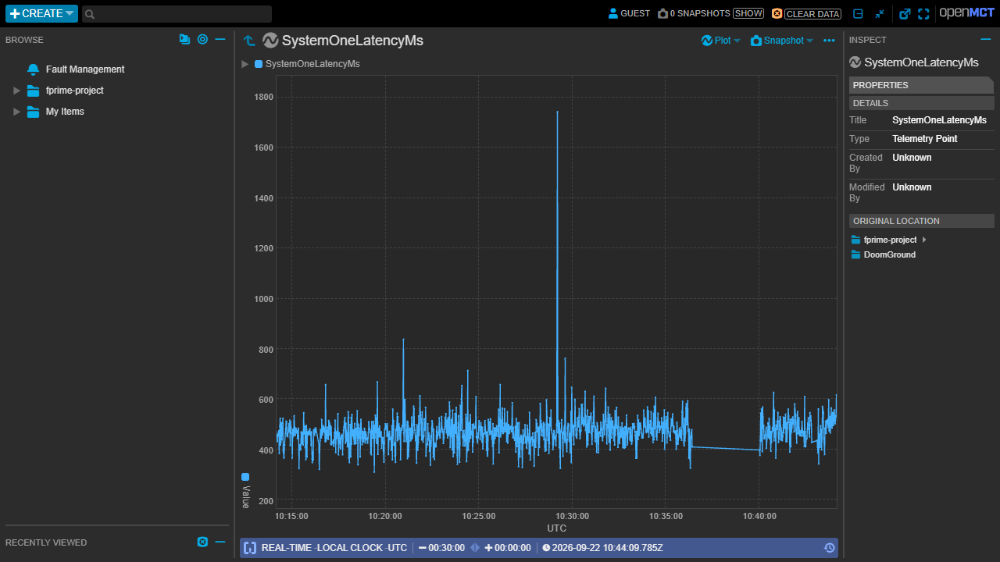
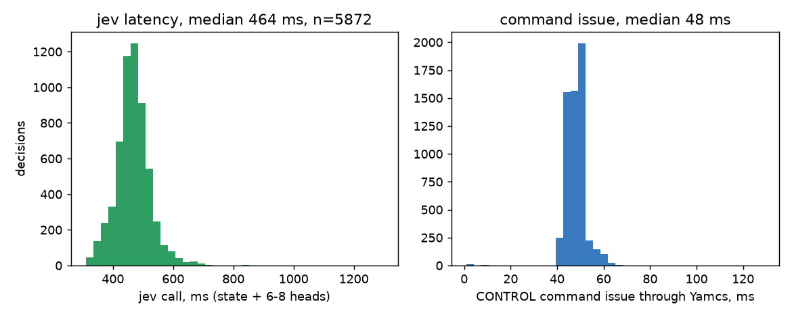
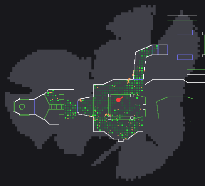
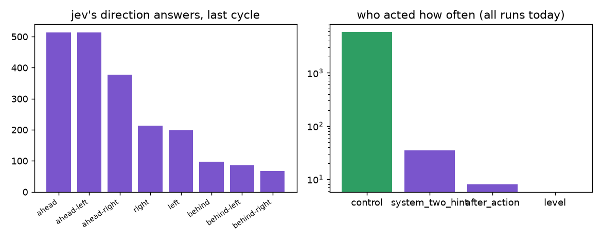
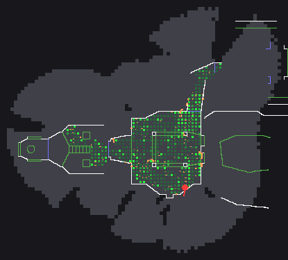

# DoomSat: playing Doom through a real mission stack, with a System One and a System Two

Kevin Horton, 22 September 2026. Built with Claude Code, TypeSafe's *jev*, NASA F´, Yamcs, NASA Open MCT and ViZDoom.

Repository: https://github.com/Devonance/DoomSat

> **Addendum, later the same day.** An audit of the decision graph found fourteen issues, most of them in the
> code around jev rather than in jev's answers: every System Two edit was being silently truncated, the
> hysteresis margin silently clamped, the after-action report was summarising heads that no longer existed,
> and the direction memory was egocentric, which is what produced the spin described in section 6. The graph
> has been rewritten against all fourteen. This report is left as it was written, because it is the record of
> what happened on the day; **`audit-2026-09-22.md` is what changed and what the replay measured.**

## 1. What this is

Doom is a stress test dressed up as a toy: interactive (uplink latency shows up as a character that turns
late), high rate (a frame every 100 ms has to be fragmented, framed, sent, deframed and reassembled) and
self-validating (a dropped or mis-decoded frame is obvious to anyone watching). We put the game behind a real
flight computer and played it from the ground through a real mission control system. The player is not a person:
TypeSafe's **jev**, a System One model, classifies the situation every half second; **Claude Sonnet 5**, a System
Two, nudges it once a minute and rewrites its questions after every attempt.

The result in one sentence: the stack works end to end under the load, every layer measured; the autonomous player
explores, opens doors and dies honestly, but does not yet finish a level. The engineering result is the first
part. The second part is documented as a failure with causes.

## 2. The stack and how the data flows

| Hop | What crosses it | Type and size | Rate |
|---|---|---|---|
| Doom -> payload | screen, depth buffer, labels, automap (seen lines only), HUD variables | ViZDoom buffers, 640x480 | 35 Hz |
| payload -> F´ Doom component | STATUS record | 112-byte big-endian struct, 56 fields | 12 Hz |
| payload -> F´ Doom component | JPEG frame; map PNG every 5 s | ~8 KB; ~2-6 KB | 10 fps |
| F´ component -> com queue | 56 telemetry channels; FrameChunk records | tlmWrite; 960-byte chunks as telemetry packets | 12 Hz; ~90 chunks/s |
| F´ ComCcsds -> Yamcs | Space Packets in fixed TM frames | APID 1/2/3, 1024-byte frames, UDP | continuous |
| Yamcs -> displays | parameters, events, command history, image products | WebSocket, HTTP, bucket objects | as they arrive |
| Yamcs -> pilot | 56 parameter values | WebSocket subscription | 12 Hz |
| pilot -> jev | structured state + 6-8 typed questions | HTTPS JSON, ~3 KB | every ~0.5 s |
| jev -> pilot | choice + probabilities per Choice head, probability per Noul head | JSON | ~450 ms after the ask |
| pilot -> Yamcs -> F´ | CONTROL(move, strafe, turn, fire, use, weapon), SET_GOAL, EXPLORE_HINT, RESET_GAME | F´ commands, CCSDS TC, UDP | one per decision |
| pilot -> Sonnet | progress check (ASCII map + walk); after-action report | text, ~4 KB; JSON, ~2 KB | every 60 s; per episode |
| Sonnet -> pilot | bearing + hold time + goal; revised graph config | JSON schema replies | 20-120 s later |

Everything on the ground reads Yamcs: the pilot, Open MCT and the dashboard have no other source.

Open MCT reads the same Yamcs: the frame product as an imagery view with its thumbnail strip, and any parameter as
a plot (here jev's per-decision latency over 30 minutes).

## 3. Measured, not asserted

| Quantity | Value |
|---|---|
| XTCE from the F´ dictionary | 156 parameters, 54 commands, all Doom channels decode |
| Frame path | 10 fps, 320x240 JPEG q45, ~8 KB, 9 chunks per frame, about 1 incomplete frame per 1000 |
| Telemetry | STATUS at 12 Hz, 112 bytes, parsed into 56 channels |
| jev decision | ~450 ms median per call including the Yamcs hop, 6-8 heads per call |
| Command issue | ~45 ms through the Yamcs HTTP API |
| Turn execution | onboard setpoint, 6 degrees per tic; a 90-degree turn lands in ~0.45 s |
| Sonnet bump | 20-60 s per call, one per minute |
| Sonnet after-action review | 100-140 s per call, ~$0.3, one per episode; graph revisions v2..v9 in one afternoon |
| Yamcs bucket | hard limit of 1000 objects; frames written into a ring of 20 names |

Integration findings that cost real time and are worth keeping:

1. F´ `string` telemetry is length-prefixed but `fprime-xtce` emits a fixed-size string type; Yamcs rejects every
   packet carrying one. Use enums.
2. Opaque byte arrays need the `!binary` annotation (fprime-xtce PR #8); the whole-struct form rejects array members.
3. `FW_COM_BUFFER_MAX_SIZE` must be raised (512 -> 1000) through a `CONFIGURATION_OVERRIDES` module, not `settings.ini`.
4. The base rate group must tick faster than 1 Hz or the aggregator holds the last chunk of a frame.
5. Yamcs delivers F´ booleans as the strings "True"/"False".
6. WSL processes launched from a `wsl bash -c` call die with it unless started with `setsid -f`.
7. The openmct-yamcs example configuration imports a demo layout bound to a Yamcs instance called `myproject`; on
   any other instance Open MCT shows "Error requesting telemetry data" until that import is removed (ours lands on
   the frame product instead).

## 4. What the player is allowed to see

Nothing from the level file. The character senses like a player:

| Sense | Stands in for | Source |
|---|---|---|
| Depth buffer | where the walls are | ViZDoom; perpendicular distance, 7.16 map units per step; 0 is the sky |
| Object labels | recognising monsters, pickups, keys, barrels | ViZDoom labels buffer, things in view only |
| Automap, seen lines only | the map a player sees on Tab | ZDoom `NORMAL` mode; walls, floor steps, ceiling changes (doors), locked doors in key colour, exit lines; only recoloured |
| HUD variables | health, armor, ammo, position, heading | ViZDoom game variables |

Not used: whole-map or show-objects automap modes, trigger-line display, sector geometry from the game state,
monster counts, item lists, cheats. The WAD statistics script is a developer tool for choosing levels and checking
results; the payload never imports it.

The payload has no planner. It stamps the automap into a raster, sweeps the floor it has seen, counts where it has
walked, and reports eight directions around the player (every 45 degrees): how far the map is open, and whether the
ground that way is unexplored, new, walked before, or has a door on the way. It also reports what is at arm's length
ahead (wall, door, exit switch, locked door, monster or barrel, or something the map does not show such as window
bars), where an exit line, a key and pickups were seen, and whether the player is stuck. What it bumps into becomes
a barrier for the rest of the level. The map of a level is kept across attempts; the game itself restarts.

## 5. jev's decision graph

jev classifies a structured state document in one forward pass and returns, per question, an option with
probabilities (Choice) or a yes-probability (Noul). It does not reason, plan or remember. The graph is therefore
one narrow question per head, options with contrastive criteria (what / not_for / examples) that reference state
fields, Nouls for yes/no heads, and code combining the answers:

| Head | Type | Options | Decides |
|---|---|---|---|
| way | Choice | the open directions among ahead, ahead-left, left, behind-left, behind, behind-right, right, ahead-right, each with its own "now" (space, ground) | the direction: jev is the navigator |
| advance | Noul | yes / no | walk forward this tick |
| use | Noul | yes / no | press Use (asked with a door, the exit or a locked door at arm's length, or when stuck) |
| fire | Noul | yes / no | with a living enemy in the crosshair and ammunition |
| dodge | Choice | Carry on / Dodge left / right / back (open sides only) | evasion from a close enemy |
| turn | Choice | Hard left ... Hard right / Turn around | aim at a visible enemy |
| weapon | Choice | Keep / Pistol / Shotgun | ammunition scarcity |
| goal (every 8th tick) | Choice | Kill enemies / Restore health / Stock ammo / Add armor / Explore | priority |

Code maps the answers onto one CONTROL command: the way becomes a turn setpoint of 0, 45, 90, 135 or 180 degrees
(or a step backward when the way behind is open), advance becomes the move, and the option probabilities give
hysteresis so the direction only changes when jev is clearly surer of the new one. A large turn is allowed to
finish before the next question is asked.

System Two on two clocks: every minute Sonnet gets seconds into the attempt, cells gained, position, the walk's
most visited spots and the map product as text, and answers with a bearing, a hold time and a goal (sent as
`EXPLORE_HINT` and `SET_GOAL`). After every episode (death, level finished, or the 3-minute budget spent and the
game reset) it gets a ~2 KB report (outcome, health, damage, cells, distance, stuck ticks, per-head answer
distributions with confidence, the walk, the last eight decisions in words) plus the current graph, and returns a
revised graph that code validates and versions.

The graph as a table, in the form of the rover demo's decision graphs: what code turns into words, the typed
question jev is asked, when, and the rule that consumes the answer. Nothing slower than jev is in the live loop.

One real decision from the last run, end to end, with the numbers Yamcs delivered, the words code made from them,
jev's probabilities and the command that went up:

## 6. Results: the stack held, the player did not finish

Runs of 22 September 2026 on shareware E1M1, jev live through the whole stack, Sonnet 5 as System Two. Each
cycle is run / review / edit / run. Cells are 32-unit map cells the character has stood in.

| Cycle | Change | Decisions | Cells | Stuck | Reached | Notes |
|---|---|---|---|---|---|---|
| planner v1 | frontier planner over the automap | 687 | 121 | 60 | start room | walked into a fake door repeatedly; turns alternated hard left/right |
| planner + steer | jev picks the way out when blocked | 202 | 147 | 0 | start room | the planner still sealed its own cell |
| local 1 | no planner; four directions, prose criteria | 124 | 56 | 1 | start room | "Turn around" 62 times: sides read blocked in every corridor |
| local 2 | eight directions, structured criteria, Nouls | 151 | 91 | 4 | start + north room | balanced directions, advance yes 60% |
| local 3 | rays stop at unseen ground; big turns finish first | 155 | 103 | 1 | start, north, west | first clean run |
| local 4 | unseen ground is "unexplored", the strongest pull | 155 | 126 | 0 | west wing (a dead end) | 4.8k units walked |
| local 5 | map kept across attempts | 250 | 246 | 7 | whole west + north | the second attempt doubles the map |
| local 6 | doors on the way in each direction's words | 295 | 275 | 3 | through the silver door into the big room | first door opened (23 Use presses); died to the first monsters, 0 kills |
| local 7 | aim/dodge whenever an enemy is visible; blocked directions are not "new"; map kept over 7 attempts | 3170 total | 559 | 11 | start, north, west, the door, first kill | Sonnet graph v9..v14; the loop kept re-walking known rooms |

Sonnet's revisions were specific and correct about what they saw: "Hold answered 78%, aligned_deg too strict,
loosened to 50"; "the goal flipped every 4 ticks between explore and add armor, raised to 8"; "the standing order
was truncated mid-word" (it was: a validator limit, since fixed); "way flipped nearly every tick, raised the
hysteresis margin". None of them could fix what the words did not carry.

## 7. Why the player did not finish, and what to do

1. **Sensing errors, not decisions.** Most of the day went into finding that jev's inputs were wrong: depth
   scale and geometry, the sky as distance zero, the crosshair and player arrow drawn into sensor buffers, barred
   windows the automap never draws, barrier marks inside the character, a blocked direction reading "new ground".
   jev answered every wrong input correctly. Each fix moved the character further.
2. **A planner hid the errors.** The first navigator turned them into confident wrong routes. Removing it and
   making jev the navigator (eight directions in words) was the right move and should have been the first design.
3. **The graph was written for an LLM at first.** Compound prose criteria, no Nouls, probabilities ignored. The
   structured graph came late; it is the version to build on.
4. **Coverage per attempt is too low.** 200-300 decisions in 3 minutes cover 100-250 cells; E1M1 needs a walk of
   several thousand units through two doors. With the map kept across attempts the loop does make progress, but it
   re-walks known rooms too often; a Score per direction ("how promising for finding the exit") combined in code
   is the next thing to try.
5. **What a wall *is* cannot be read from the automap alone.** Doors and exit lines are coloured; switches, lifts
   and signs are not. A small vision classifier over the screen patch at arm's length (door / switch / exit sign /
   wall / monster / pickup), or jev fed with a few numbers from that patch (dominant colours, edge density, whether
   it tiles, its height), is the honest replacement. This is where a vision decision model would slot in.
6. **Combat is barely tested.** The aim and dodge heads now fire whenever an enemy is visible. The first fight of
   the day was lost with no shots fired because the goal head had not switched to fighting; in the last attempt of
   the day the character answered fire 3 times, made its first kill and came out at 13 health with one shell
   left. One fight is not a result.
7. **Height is invisible.** The range camera is at eye level; drops and platforms are learned by bumping. A second
   depth band below the horizon would give "a drop ahead" cheaply.

The handoff for the next pass, with the full list of what made us stuck and the research leads, is
`docs/HANDOFF.md`.

## 8. Sources

- NASA F´ v4.3.0: https://github.com/nasa/fprime
- fprime-yamcs 0.2.1: https://github.com/fprime-community/fprime-yamcs; fprime-xtce (binary annotation branch): https://github.com/FarkasJoseph/fprime-xtce/tree/feature/binary-annotation-combined
- Yamcs 5.12.8: https://github.com/yamcs/yamcs; yamcs-client 2.1: https://github.com/yamcs/python-yamcs-client
- NASA Open MCT: https://github.com/nasa/openmct; openmct-yamcs: https://github.com/akhenry/openmct-yamcs
- TypeSafe jev and System One docs: https://docs.typesafe.ai/introduction, https://docs.typesafe.ai/primitives/advanced, https://docs.typesafe.ai/concepts/how-to-build-with-system-one, https://docs.typesafe.ai/sdk/python/api
- Claude Sonnet 5 through Claude Code: https://code.claude.com/docs
- ViZDoom 1.3.0: https://vizdoom.farama.org, https://github.com/Farama-Foundation/ViZDoom (ZDoom automap source: https://github.com/Farama-Foundation/ViZDoom/blob/master/src/vizdoom/src/am_map.cpp)
- Shareware Doom IWAD (Debian `doom-wad-shareware`); Freedoom: https://freedoom.github.io
- The System One demo this graph descends from (its Doom demo reads the WAD; ours does not): https://github.com/sgoedecke/system-one
- Prior LLM-plays-Doom work: https://adriandewynter.substack.com/p/will-gpt-4-and-5-run-doom
- Graphviz (diagrams), Playwright + Chrome (screenshots, recording), tectonic (PDF), imageio-ffmpeg (video)
